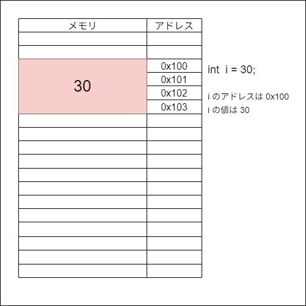

# **メモリとアドレス**

ポインタはプログラムを初めて間もない方々にとって大きな壁になる。  
ポインタの概念自体は特に難しい事はない。  
ただしポインタを利用するコードとその挙動、結果はプログラマをよく混乱させる。

また、そもそもポインタを利用する事自体が非常に <span style ="color: red;">**危険な行為**</span> になる。  

- 確保していない箇所のメモリに値を書き込む
- 意図せず他の変数を上書きする

といった事態をポインタは容易に実現させてしまう。  

ポインタを扱うのは危険ではあるが**物を作る上で非常に強力な武器**になる。  
残念ながら C/C++でゲームを作る上でポインタの利用は必須となる。

---

## **前提の把握**

ポインタの話に入る前にまず把握しておくべき事がある。  

変数が宣言されたとき、メモリ上のある位置から指定サイズ分確保される。  
その確保された領域に値を書き込んだり、その領域から値を読み取るなどを行う。  

ここで言う「位置」を<span style ="color: red;">**アドレス**</span> と呼ぶ。  
メモリ上の全ての位置には、アドレスと呼ばれる番号が割り振られている。  
そして、このアドレスの単位はバイトになる。

`int 型`の変数を一つ宣言した際、仮に 0x100 のアドレスから始まったとすると、  
そこから 4 バイト分確保される為、0x100、0x101、0x102、0x103 の領域が確保される事になる。  

変数に 30 を代入した際、その「30」という値は、この領域を使って記録される。  
変数の為に確保したアドレスの中の先頭のアドレスは<span style ="color: red;">**変数のアドレス**</span> と呼ばれる。



ここで気を付けておくべき事がある。  
それは<span style="color: red;">**変数のアドレス = 変数で保持している値ではない**</span>という事。  

---
## **変数の寿命**

変数には**寿命**が存在する。  
そしてすでに意図せずにその事を意識したプログラムを書いていると思う。

```c++
    for (int count = 0; count < 100; ++count)
    {
        int i;
        i = 0;
    }
    i = 0; 
    count = 0;
```

こんなことはできない。  
`i` と `count` が使えないというコンパイルエラーになる。  
では次に

```c++
    if (true)
    {
        int i;
        i = 0;
    }
    i = 0;
```

こんなこともできない。  
これも同じく `i` が使えないというコンパイルエラーになる。

変数には**変数として利用できる期間**が存在する。  
これを変数の**スコープ**あるいは**寿命**と呼ぶ。  

### **変数のスコープ範囲**

`i` や `count` はローカル変数であり、  
**波かっこの開始から終了までの間**が利用できる期間となる。  
波かっこの間で宣言された変数は、波かっこ内では使えるが外では利用できない。  

**波かっこを階層として考えてもらう**のが良い。  
同じ階層、あるいは下の階層であれば生きているので使えるが、  
上の階層に戻ると寿命が切れて使えなくなる。  

### **寿命が切れた変数のアドレス**

寿命が切れた変数のアドレスとその中身はどうなるか？  
当然そのアドレスはその変数用として使えなくなる。  

正確にいうと、  
<span style="color: red;">コンピュータが「現在利用していないアドレス」として認識し、そのアドレスを別の事に再利用する</span>。  
別の変数が宣言された際にそのアドレスを割り当てるなど。  

なおグローバル変数の場合、どの波かっこにも属しておらず最上位の階層にいる。  
その為グローバル変数はアプリケーションが終了するまで生き続ける。
