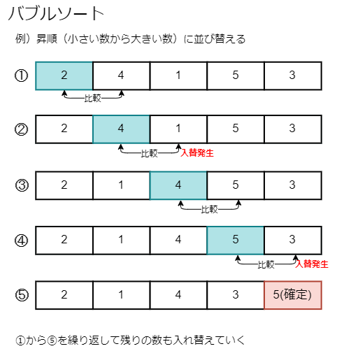
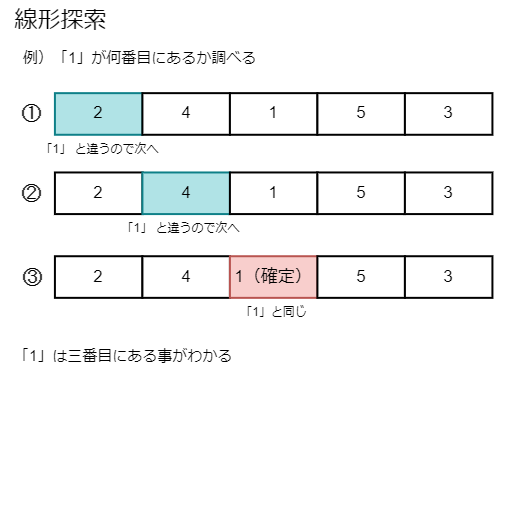

# **簡単なアルゴリズム** #

---

## **並び替えのアルゴリズム「バブルソート」**

「隣り合う数値同士を見比べて、条件に応じて入れ替える」という事を繰り返す。  
単純である為、コーディングしやすい反面、  
並び替えの対象が膨大になると、完了するまでに時間がかかる様になる。

---

## **探索のアルゴリズム「線形探索」**

「内容を順に確認していき、探している内容と同一かどうかをチェックする」という事を繰り返す。  
こちらも単純である為、コーディングしやすい反面、  
探索対象が膨大になると、見つけるまでに時間がかかる様になる。

