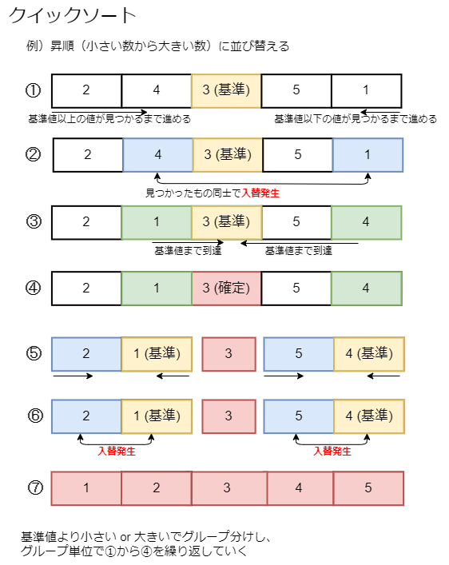
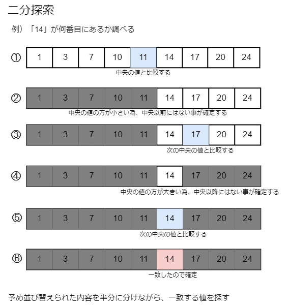

# **複雑なアルゴリズム**

---

## **並び替えのアルゴリズム「クイックソート」**

「軸となる値を決め、軸を境に先頭と末端から軸へ向かわせながら入れ替えて分割する」という事を繰り返す。  
**軸**が並び替える対象を綺麗に二分出来る値だった場合、高速に並び替えを行える。  

ただし、並び替える対象を綺麗に二分出来る値ではなかった場合や、  
並び替えの対象が少ない場合、バブルソートより完了が遅くなる。  
コーディングしようとすると、とても複雑な内容になる。  

---

## **探索のアルゴリズム「二分探索」**

「予め並び替えられたデータの中央値と、探してるデータの大小を比較して探索対象数を半減させる」という事を繰り返す。  
中央値と比較する度に探索対象が半分になる為、非常に高速に探す事が出来る。  

ただし前提条件として 探索対象がすでに並び替えられている必要がある。  
並び替えられていない場合は、まず並び替えをしないといけない為、  
二分探索する度に大量のデータを並び替えなければならない様な場合は、  
結果として線形探索より発見が遅くなる。

