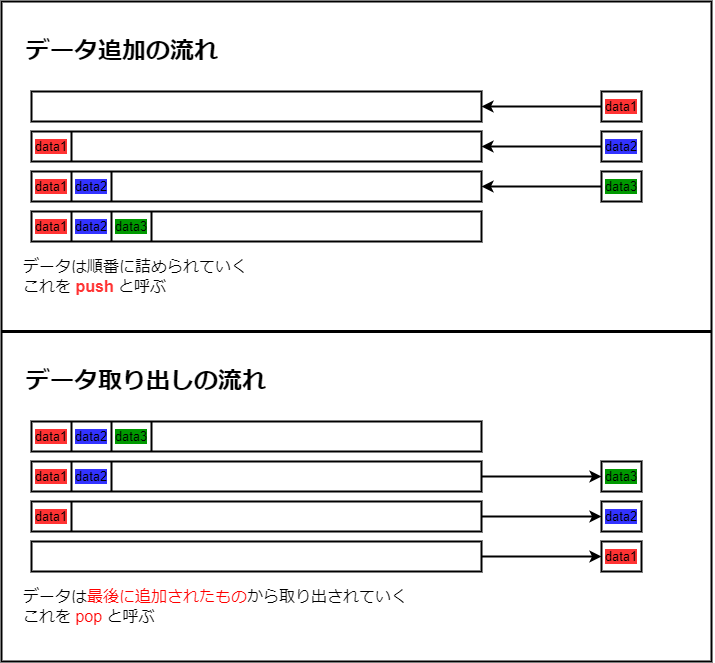
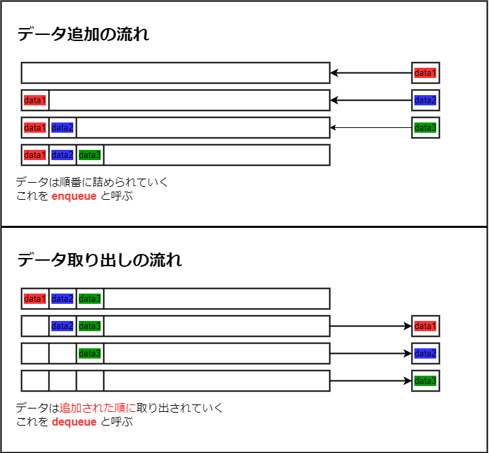
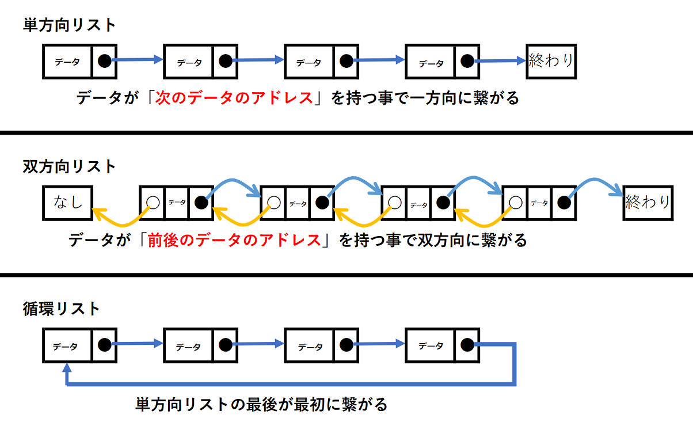
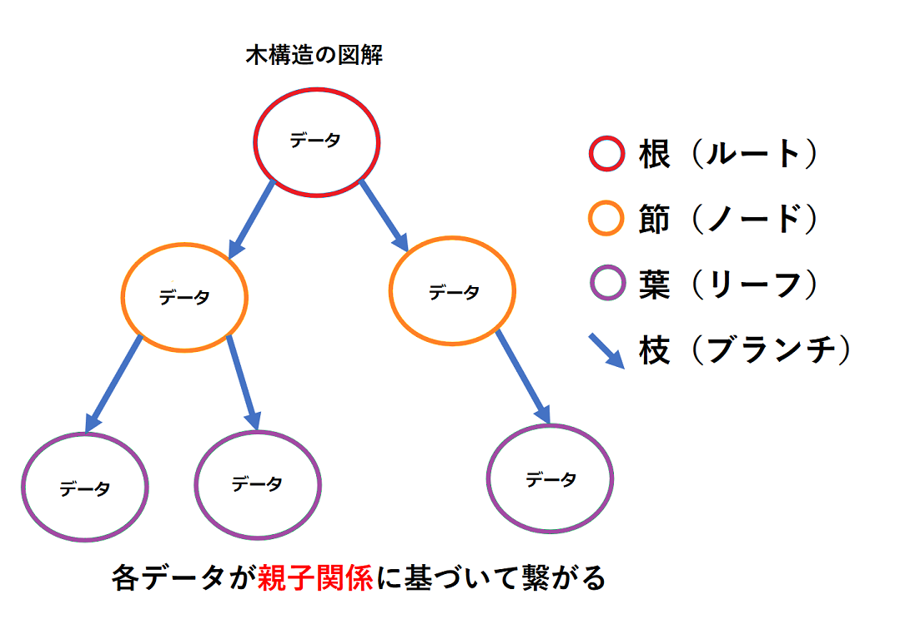

# **データ構造**

アプリケーションでは、様々なデータを保持する必要が出てくる。  
データを保持する基本的な方法として、これまで下記の物を利用してきた。

- 変数
- 構造体

極論、これらさえ知っていれば大半の事は実現する。  
ただし、これらは**最低限知っておくべき内容**に過ぎず、  
実際に複雑なアプリケーションを作成する上では、  
これらをさらに **扱いやすい形で管理出来る事** が重要になってくる。

変数も構造体も結局はデータの塊だが、  
そのデータの**特徴**を踏まえて**その特徴にふさわしい管理の形**を考える必要が出てくる。

**データ構造** はそういった **各情報の管理方法** を考える際に必要になる。

---

## **データ構造の把握が必要な理由**

- **データの特徴に合わせた様々な管理方法を知る為**    
アクションゲームやシューティングゲームでは    
敵や弾など、ゲーム中大量に発生するオブジェクトがある。  
　  
当然一つ一つ変数や構造体にデータが保持されているが、  
今までの様に一つ一つ宣言して保持していると、  
非常に扱いにくい物になるのが想像できるだろうか？  
　  
ゲーム中でどういう扱い方がされるかによって、  
好ましい管理方法は変化する。  
その事を知っておく必要がある。  

- **C++のSTL（標準ライブラリ）を利用する為の事前知識を得る為**  
C++にはSTLと呼ばれるライブラリが存在する。    
そのライブラリの一部に、データ構造を簡単に実現してくれる物がある。  
　  　  
自作しながらデータ構造の仕組みを知る事で、  
実際にSTLを利用する際の抵抗をなくしつつ、その特徴を把握できるようになってもらえればと思う。　　

- **様々な応用技術の基礎知識として必要である為**  
幾つかのデータ構造は、その特性から最適化やアルゴリズムとして利用されている。  
データ構造の知識がある前提で成り立つ技術も多く存在する。   

---

## **データ構造とは**

データの集まりをプログラムで扱いやすい様に **特定の決まりに基いて格納できる「箱」とその「ルール」の総称** を指す。 

幾つか種類があり、自身が扱いたいデータの内容によって利用すべきデータ構造は変わる。  
注意するべき点として、利用するデータ構造の選択を間違えると **逆に管理しにくい形** になる。

最も基本的なデータ構造はすでに利用した事があるはず。  
配列がそれにあたる。

---
## **スタック**

引っ越しの段ボールの荷物等でイメージすると良い。  
段ボールに先に入れたものは底にあるので、取り出す時に最後になる。  
逆に段ボールの一番上に入れたものは、段ボールを空けて最初に取り出す事になる。  

その特徴から、**割り込んで何かをする** 場合に向いている。  
**「新規で発生したデータを必ず最優先で処理したい」**等に利用しやすい。 

実は関数呼び出しもスタックの形になっている。  
関数の呼び出し履歴のウィンドウがコール「スタック」と呼ばれている。  
ある関数に入り、その関数内で呼び出された関数に入り、さらにその中で…と続くが、  
必ず最後に入った関数が最初に処理を完了しているはず。   

スタックを自作する場合、**配列の様にメモリ上で連続しているイメージ** で考えるとわかりやすい。

---

## **キュー**

飲食店の行列をイメージすると分かりやすい。  
行列に並んだら、並んだ順に店に入っていく。  

その特徴から **順番に何かをする** 場合に向いている。    
**「発生した順番を厳守して処理したい」**といった場合に利用しやすい。

プリンタやキーボードの入力がキューで処理されている。  
キューという言葉は今後耳にする頻度も高いと思う。  
「リクエストを行ってキューに積む」といった言葉は、ネットワークや描画処理などでもよく言われる。  

こちらもスタックと同じく、自作する場合は**配列の様にメモリ上で連続しているイメージ** で考えるとわかりやすい。

---

## **リンクリスト**
単に「リスト」と呼ばれる方が多い。  

例えを強いてあげるとすると「前にならえ」など。  
号令があったら先頭の人が位置を合わせ、  
次の人が前の人の位置に合わせて自分の位置を調整し、  
また次の人が…というように、  
先頭の人の行動が連鎖的に後ろの人に影響を与える。

その特徴から **繋がっているデータを連鎖的に処理する** 場合に向いている。

先頭、または最後尾のデータだけ把握できていれば、  
連結しているデータを辿って全て処理していく事が出来るようになる。

また、リンクリストには **データの追加や削除が簡単に行える** という強みがある。 

配列などの場合、挿入や削除がやりにくい。    
下記のプログラムをどう作るか想像してみて欲しい。

-  要素数が 100 の int 型配列を宣言する  
-  0 から 99 までの値を各要素にランダムに代入し表示する　　　　 例 ) 3, 0, 1, 57 ...  
-  配列の先頭の値を「100」に変更し、元の値を一つ後ろにずらす　　例 ) 100, 3, 0, 1, 57 ...  

やろうとすると案外面倒な事が分かる。  
配列の全要素で、保持しているデータを一つ後ろに上書きしていく必要がある。  
これは配列が「メモリ上で連続しているデータである」ため。
 
リストの場合は **メモリ上で連続しているデータではない** ので、  
繋がっているデータへのアドレスを設定しなおすだけで挿入が簡単に行える。  
削除の場合も同様。

その代わり**メモリアドレスやポインタ変数を正しく把握して利用する事が必須になる**。   
その為、配列、スタック、キューに比べて自作難易度が高い。

---

## **木構造**
おそらく色々な所で実際に目にする機会の多いデータ構造。  

リスト構造をベースに親子関係を作成する事で、  
より処理するべきデータ、関連したデータを纏めやすくなる。  
その特徴から**関連の強いデータのみを対象にした連鎖的な処理**に向いている。

フォルダ構成や Unity の SceneHierarchy、  
3Dのアニメーション制御から処理負荷軽減など、  
至る所でこの構造を見る事になると思われる。

木構造には、探索する事に適した種類もあり、  
一部の探索アルゴリズムでは木構造である事を前提としている物もある。

　

　
　