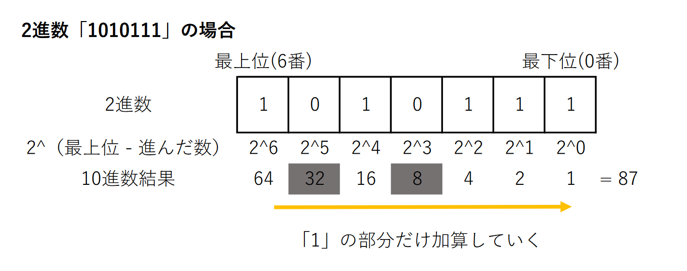
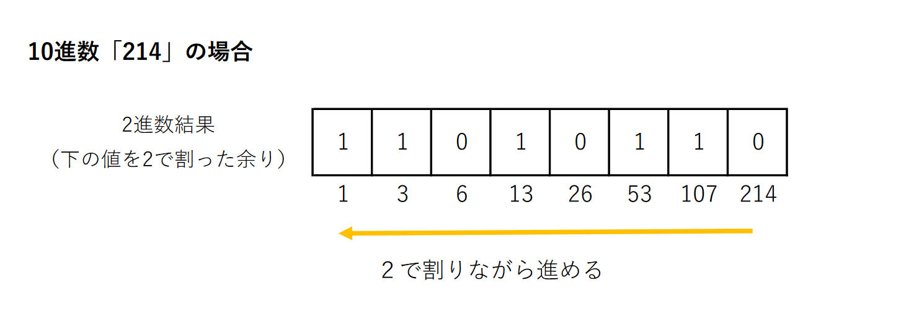
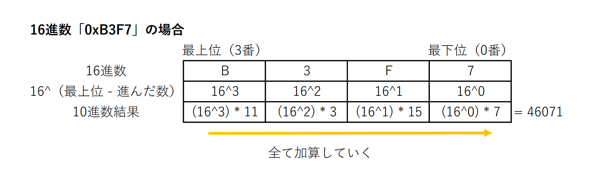
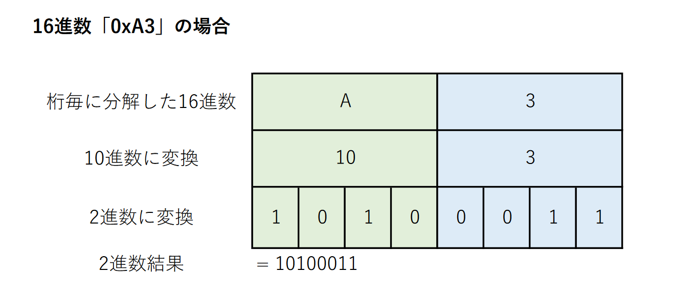
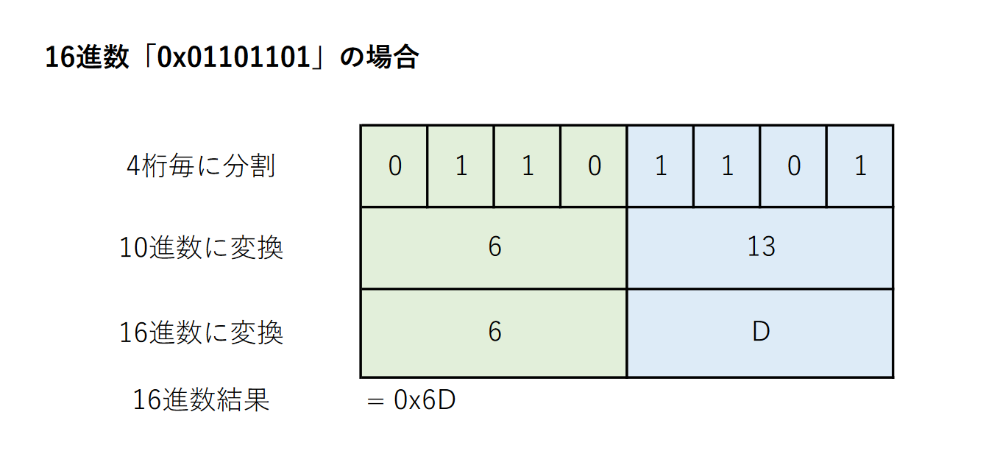
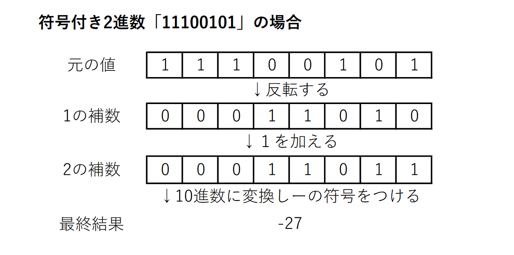

# **進数計算、ビット制御**

---

## **プログラムでの進数**

コンピュータで扱うデータは、全て**0 or 1 のビット情報の集合**になる。  
0 or 1 の集合であることから、  
二進数をはじめとした進数をある程度把握しておかなければならない。

- 2進数と16進数に対する抵抗を軽減する
- ビット単位の論理演算を利用できる様になる
- メモリの内容を書き換えてる意識を持つ

といった事を通じて、  
<span style="color: red;">**コンピュータの低レベルな部分をプログラムで利用する事に慣れる事が必要**</span> 

---

## **進数計算**

### **2進数から10進数へ**  
2進数の値を X に置き換えると、以下の手順で変換できる。  

① X の最上位の桁から状態を確認していく  
②「1」になっていたら、２^（最上位 - 進んだ数）を求めて加算する  
③ 最下位であれば終わり、違う場合は下位に進んで ② に戻る  




### **10進数から2進数へ**
10進数の値を X に置き換えると、以下の手順で変換できる。  
最下位の桁から埋めていく。

① X を２で割った余りを、その桁に値にする  
② 上位の桁に進む  
③ X を２で割る  
④ X がゼロになれば終わり、ゼロでなければ ① に戻る  




### **16進数から10進数へ**
やり方は「2進数から10進数へ」と基本同じ。  
気を付ける点は、2進数と違い、桁の値が係数になる点。



### **10進数から16進数へ**
やり方は「10進数から2進数へ」と同じ。  
2進数の場合は、余りや割り算をする際に「2」で行っていたが、  
それを「16」に変えればいい。


### **16進数から2進数へ**
16進数の値を 0xXXXX に置き換えると、以下の手順で変換できる。  

① 「XXXX」を1桁ずつ分解する  
② 1桁分（0~F）を10進数(0~15)に置き換える  
③ 上記を4桁の2進数に変換する  
④ 変換した2進数を順につなげる  



### **2進数から16進数へ**
2進数の値を X に置き換えると、以下の手順で変換できる。  

① X を最下位から4桁ずつ分解する  
② 分割された4桁の2進数を10進数(0~15)に置き換える  
③ 上記を1桁の16進数(0~F)に変換する  
④ 変換した16進数を順につなげる  




### **負数と２の補数**
負の値も進数変換可能だが、**補数**という物が必要になってくる。  

**１の補数**とは「**2進数の１と０を反転させた値**」であり  
**２の補数**とは「**１の補数に1を加えた値**」を指す。

与えられた2進数が負数なのかかどうかは、  
「**符号付き or 符号なし**」で判断される。  
「符号付き」の場合、最上位の値が「プラスかマイナスか」を指すようになる。



---

## **符号付き or 符号なしをプログラムで指定する**
プログラムで変数を宣言する時、  
「符号付きとして扱うか」or「符号なしとして扱うか」を  
指定する事が出来る。

```c
// 符号付きのchar型
char value = 0; // 表せる数値は「-128~127」

// 符号なしのchar型
unsigned char value = 0; // 表せる数値は 「0~255」

```