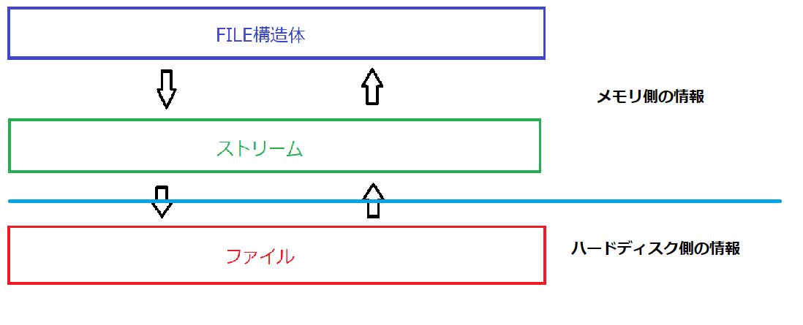
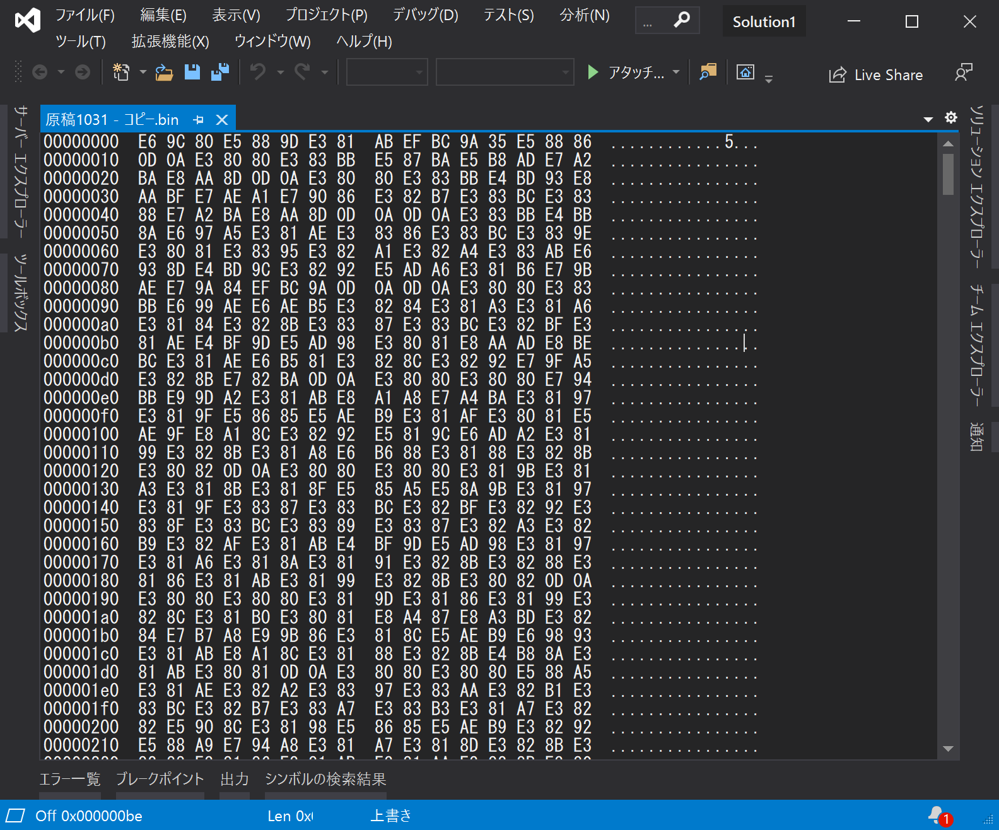

# **ファイル操作**

---

## **ファイルやデータ**

ゲームはプログラムだけで動くものではない。  
プログラムでデータを動かして漸く「ゲームが動く」といえる。

ファイルやデータの「保存 and 読込 and 操作」をプログラムで制御して初めて、  
ちゃんとしたゲームを作り上げていく事が出来る。

**どんなファイルやデータでも抵抗がなく扱える様に慣れておく事が大切**。

- 普段やっているデータの保存、読込の流れ  
- ゲームやアプリケーションは読み込んだデータの塊である  
- 特殊なデータの扱い方

これらを意識出来るようになる為に、ファイル操作を学ぶ必要がある。

---

## **ファイル操作の手順**

**①開く　→　②読み取るor書き込む　→　③閉じる**  
どの様なファイルでもこの手順を踏む。  

---
 
## **FILE構造体** 

**操作したいファイルを扱うC言語標準の構造体**  
どの手順でもこの構造体のポインタを利用し、  
ファイルの情報を読み書きする。  



---

## **モード**
**ファイルの扱い方を指す文字列**  
ファイルを開く手順で指定する。  

ファイルを  
・読み込むのか  
・上書きするのか  
・最後尾から追加するのか  
等を指定する為に必要になる。  

|  文字列  |  内容  |　ファイルが既にある | ファイルがまだない |
| ---- | ---- | ---- | ---- |
|  r  |  読み込む  | 成功 | 失敗  |
|  w  |  書き込む（上書き）  | 内容を全削除 | 新規作成  |
|  a  |  追加で書き込む  | 末尾に追加する | 新規作成  |
|  r+  |  両方  | 成功 | 失敗  |
|  w+  |  両方  | 内容を全削除 | 新規作成    |
|  a+  |  読み込む/追加で書き込む  | 末尾に追加する | 新規作成  |

さらに、追加文字列に[b]というものがある。

---
## **EOF**
**ファイルの終端を表す**  
一部の関数では戻りでEOFが返ってくる

--- 

## **ファイルの種類**
ファイル操作で扱うファイルには二種類ある。  
・テキストファイル  
・バイナリファイル  

### **テキストファイル** 
テキストファイルは「文字のみを扱うファイル」  
正確には「保存されている数値を必ず**文字を表す番号**として扱うファイル」  
単純な構造であるため、人の目で見て把握しやすく、どのような環境でも利用できる。

ただし、「文字を表す番号」には色々種類がある。  
・UTF-8  
・Shift_JIS  
など

これらは**文字コード**と呼ばれる。


### **バイナリファイル** 
バイナリファイルは「コンピュータが扱いやすい形になっているファイル」  
テキストファイル以外はすべてバイナリファイルと考えてもらっていい。  
バイナリファイルは人の目から見てぱっと見で判断が付かない。  
2進数の塊で出来ているデータ。



単なる数値でしかない為、その数値をどう扱うかはプログラム次第になる。  
「41」という数字が入っていても、それが「文字」なのか、「数値」なのかは判断できない。

--- 
 
## **バイトオーダー** 
メモリ上に「どの順番で情報が入るか」という物。  
「**リトルエンディアン**」「**ビックエンディアン**」の二つを覚えておくといい。  

例として「0xAABBCCDD」の数値を格納した4バイト変数があるとする。  
その数値の1バイト毎のメモリ格納結果は、バイトオーダーによって変化する。

#### ビッグエンディアンの場合の内容
|  0xAA  |  0xBB  |  0xCC  |  0xDD  |　

#### リトルエンディアンの場合の内容
|  0xDD  |  0xCC  |  0xBB  |  0xAA  |　

**バイトオーダーはCPUによって決まる。**

---

## **アラインメントとパディング** 
下記構造体のサイズは、いくらか？  

```c
// 構造体（サイズは10？）
struct Str
{
	char  a;
	char* b;
	int   c;
	char  d;
};
```

実際は10ではない。  
それぞれの型には、アラインメントと呼ばれる数値があり、  
メモリ確保時には、その倍数のアドレスに配置されるルールがある。

アラインメントを考慮して配置された際に生まれる「空」の領域をパディングと呼ぶ。


```c
// 構造体（32bit環境でパディング込みの場合）
// 64bit環境では結果が変わる
struct Str32
{
	char a;
	char padding1[3];
	// ---- 4バイト境界
	char*  b;
	// ---- 4バイト境界
	int c;
	// ---- 4バイト境界
	char d;
	char padding2[3];
	// ---- 4バイト境界
};


```