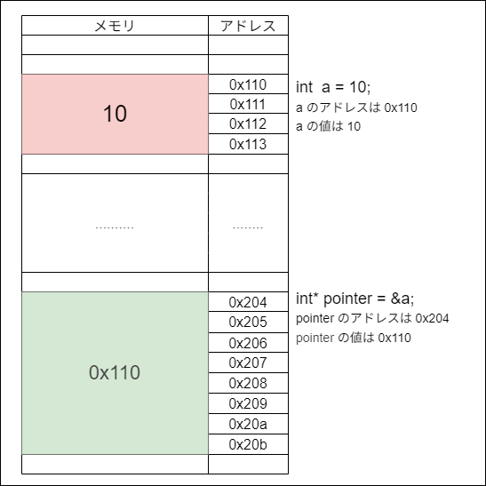
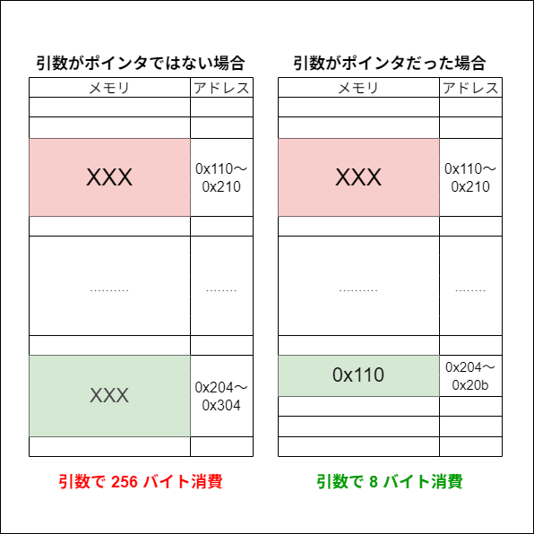

# **ポインタ**

---
## **アドレスを保持するポインタ変数**

ここからが本題のポインタ。  
「何のために利用するのか」より、まず「どう利用するのか」を紹介する。

```c++
    // int 型の a 変数に 10 を代入 
    int a = 10;
    printf("a が保持する値は %d です\n", a);

    // a 変数のアドレスを int 型のポインタ変数 pointer に代入 
    int* pointer = &a;
```

### **ポインタ変数の宣言**

今まで `int`、`float`、`char`　等、色々な型で変数を宣言し利用してきた。  
そして今回のポインタも実は単なる変数でしかない。    
<span style ="color: red;">**アドレスを保存する為の変数**</span>となる。  
その為、宣言の方法も今まで行ってきた方法と同じ。

ただし「これはポインタ変数である」という事を明確にする為、  
その目印として**アスタリスクを型の後ろにつける**。  

「指定した型 + アスタリスク」で、  
その型の変数のアドレスを受け取るポインタ変数を宣言する事が出来る。

```c++
    // 宣言
    int* pointer;
```

### **ポインタ変数へ代入**

次は変数のアドレスを代入する部分。

変数をそのまま `=` で渡すと、それは変数が保持する**値**を渡す事になる。  
<span style="color: red;">**ポインタ変数が受け取るのは、保持している値ではなくアドレス**</span>。  
その為渡す側も**渡すものがアドレスである事を明確にしなければならない**。  
その目印として**変数の前に`&`を付ける**。
```c++
    // a のアドレスを代入
    int* pointer = &a;
```

仮にアドレスを受け取りたい変数の型が `int` ではなく、`float` なら
```c++
    float* pointer = &a;
```
となる。

なお**自作の構造体である Parameter 型の変数のアドレスも受け取れる**。
```c++
    Parameter* pointer = &parameter;
```

### **ポインタ変数が保持する内容**

受け取ったポインタがどんな内容を保持しているのか確認する。

```c++
    printf("value のアドレスは %p です\n", pointer);
```

冒頭でも挙げたがポインタは**アドレスを保存する為の変数**となる。  
つまり「何かのアドレス」を保持させないと利用できない。  

---

## **ポインタ変数のサイズ**

ポインタも変数の一種なので `int 型`や `char 型`の様に当然サイズがある。  
各位利用している PC は64ビット環境だと思うので、  
**ポインタ変数のサイズは 8 バイトになる**と思う。   

が、Visual studio では 32 ビット環境に対応したアプリケーションを作成する事が出来る為、  
プロジェクト設定によって変える事も可能。

- 64 ビット環境だと 8 バイト  
- 32 ビット環境だと 4 バイト  

環境によって違うという点を留意しておく。  
なおどんな型のポインタ変数であっても**ポインタ変数である限りサイズは同じ**。


---

## **ポインタ変数の更新**

ポインタは他の変数と同様に  
保持しているアドレスを更新する事が可能。

```c++
    int a = 10;
    printf("a が保持する値は %d です\n", a);

    int b = 30;
    printf("b が保持する値は %d です\n", b);

    // pointer に a のアドレスを代入する
    int* pointer = &a;
    printf("a のアドレスは %p です\n", pointer);

    // pointer に b のアドレスを代入する
    pointer = &b;
    printf("b のアドレスは %p です\n", pointer);
```

`a` のアドレスを持っていたのが `b` のアドレスに変わった。  
`b` のアドレスに更新したからといって `a` が消える訳ではない。  
当然 `a` や `b` の中身が消える訳でもない。

では下記の代入はどうか？
```c++
    pointer = 10000;
```

これはコンパイルエラーになるが<span style="color: red;">出来たとしてもやるべきではない</span>。  
なぜなら<span style="color: red;">**10000 が何のアドレスなのか分からないから**</span>。  

ちなみに「出来たとしても」と述べたが出来る方法はある。  

---

## **ポインタ変数が指す先の更新**

「ポインタ変数はアドレスを保持している」と述べたが、  
<span style="color: red;">**ポインタ変数を経由し、そのアドレスの位置にある値を更新したり取得したり出来る**</span>。

```c++
    int a = 10;
    printf("a が保持する値は %d です\n", a);

    // pointer に a のアドレスを代入する
    int* pointer = &a;
    printf("a のアドレスは %p です\n", pointer);
    
    // ポインタ経由で a が保持している値を書き換える 
    *pointer = 100;
    printf("a が保持する値は %d です\n", a);
```

ポインタ変数の前に「アスタリスク」を付ける事で  
<span style="color: red;">**「ポインタ変数が保持するアドレスの位置に保持されている内容」つまり a の内容を書き換える事が出来る**</span>。  

```c++
*pointer = ・・・・
``` 
と記述するのは 
```c++
a = ・・・・
``` 

と記述しているのと全く同じという事。  

何故こんなことができるかだが、  
**ポインタ変数は値ではなくアドレスをもっている**から。

アドレスつまり位置。  
値そのものは把握していないが、値が入っている位置は知っている。  
位置さえ知っていれば内容を書き換える事が出来るという事。

一見ややこしいが「ポインタ変数経由で内容を書き換えられる」というのは非常に有用。

--- 
## **ポインタ変数を利用する利点**

### **1. 引数から関数外の変数を更新できる**

```c++
void update1(int value)
{
    value = 100;
}

void update2(int* pValue)
{
    *pValue = 100;
}
```

二つの関数があり、  
片方は int 型変数を引数に渡して、100 に上書きしている。  
片方は int 型のポインタを引数に渡して、100 に上書きしている。


**① 前者の例**

```c++
int a = 0;
update1(a);
printf("a が保持する値は %d です\n", a);
```
引数に渡すと、関数内で利用する変数としてメモリ上の別の所に複製される為、  
例え変数内で内容を更新しても、関数を呼び出した際に指定した変数の内容は変わらない。  

**② 後者の例**

```c++
int* pointer = &a;
update2(pointer);
printf("a が保持する値は %d です\n", a);
```

ポインタ変数`pointer`の内容は、引数のポインタ変数`pValue`に複製されている。  
つまり `pValue` には 変数 `a` のアドレスが入る。  

アドレス、つまり位置が分かってる状態。  
関数の外で宣言された変数の内容であっても、引数のポインタ変数を経由すると書き換えられる。

### **2. 巨大なサイズの変数の複製を回避できる**
もう一点 <span style="color: red;">**メモリを節約して情報を受け渡し出来る**</span>という非常に大きい利点がある。  

例えば**大容量の変数を持つ構造体型の変数を関数に渡す時**の事を考えてみてほしい。

「引数で渡すと複製される」と述べた。  
では大容量構造体型の変数をそのまま引数で渡すとどうなると思うか？  
**その大容量構造体型の変数が、引数用に丸々別メモリに確保されてしまう**。

対してポインタ変数のサイズはいくらか？  
せいぜい **8 バイト**であり、それは**大容量構造体型のポインタ変数だったとしても変わらない**。

**ポインタ変数で関数に渡した方がメモリの消費を抑えられる**。



メモリを大きく消費する事は、  
メモリが足りない事だけではなく処理負荷にも影響してくる。

---

## **ポインタ変数 and ポインタ変数が指す先の内容の更新を禁止する**

関数の引数で巨大な構造体をそのまま渡さず、  
ポインタ変数で渡す事でメモリ消費を押さえられるが、  
<span style="color: red;">**引数の内容を利用したいだけなら、更新出来ない形で渡せた方が安全**</span>。

```c++
// 超巨大な構造体のアドレスを持つポインタ変数を渡す
bool check(MyStruct* p)
{
    // MyStruct が持つ a の値を確認したいだけ
    int b = p->a;     

    // だが更新する事も出来てしまう
    p->a = 5;

    return b == 3;
}
```

そういった時に以前紹介した `const` キーワードが役に立つ。  
引数に `const` を付けると構造体の中身を更新する事が出来なくなる。

```c++
// 超巨大な構造体のアドレスを持つポインタ変数を渡す
bool check(const MyStruct* p)
{
    // MyStruct が持つ a の値を確認したいだけ → 問題ない
    int b = p->a;     

    // コンパイルエラーが発生
    // 構造体の内容が絶対に変わらないので安全
    p->a = 5;

    return b == 3;
}
```

こういった予防策を張っておく事で、手違いによる不具合などを事前に回避出来る。

### ポインタ変数と const のややこしい関係

ポインタ変数の場合、`const` をつける事によって**更新できなくなる対象が変わる**。  
上記の例の様に、変数型の前に `const` を付けると<span style="color: red;">**ポインタ変数が指している先の内容が不変になる**</span>。  
ところが変数型の後ろに `const` を付けると<span style="color: red;">**ポインタ変数そのものが不変になる**</span>。  

```c++
int value = 10;

// int* の前に const をつけた「valuePtrA」を宣言
const int* valuePtrA = &value;
*valuePtrA = 1;		    // コンパイルエラーになる（ポインタ変数が指す先が更新できない）
valuePtrA = nullptr;	// 問題ない

// int* の後に const をつけた「valuePtrB」を宣言
int* const valuePtrB = &value;
*valuePtrB = 1;		    // 問題ない
valuePtrB = nullptr;	// コンパイルエラーになる（ポインタ変数そのものが更新できない）
```


--- 
## **配列とポインタ変数**

要素数が 4 の int 型の配列の中で、  
添え字が 2 の位置にある要素のアドレスをポインタ変数に代入するには、  
どうすれば良いか分かるか？ 

```c++
int array[4];

int* p = &array[2];
*p = 10;
```

この様に配列の要素であっても、添え字を指定してアドレスを取得する事が可能。  
通常の変数が繋がっているだけなので、それぞれのアドレスも取得出来る。

そしてもう一点、配列には他にはない特徴がある。

```c++
int copy = array;
```

このコードはコンパイルエラーになるが、  
```int * で int を初期化する事が出来ない```と言われている。

実はここで記述している ```array``` はポインタ変数と同じ存在になっている。  
配列は添え字を指定しなかった場合、<span style="color: red;">とあるアドレスを持っているポインタ変数として利用できる</span>。

ここでいう「とあるアドレス」とは、  
**添え字がゼロ**、つまり<span style="color: red;">**配列の先頭要素のアドレス**</span>になる。


その為下記のコードでは両方同じアドレスを取得している。
```c++
int* p1 = &array[0];
int* p2 = array;
```

もう一点、  
配列は「要素数分繋がっている物」だが、  
これは<span style ="color: red;">**メモリ上でも繋がっている**</span> 。  

まずは上記で宣言している配列```array``` の各要素のアドレスを、  
printf で表示するプログラムを作る。

```c++
int array[4];
for (int i = 0; i < 4; ++i) {
    printf("%p\n", &array[i]);
}
```

結果を確認すると「ある規則」に気付かれるかと思う。  
**数値が 4 ずつ増えている**。  
アドレスはバイト単位なので** 4 バイト間隔で並んでいる**事を指している。  

 4 バイト間隔で並んでいるのは **int 型の配列だから**。  
char 型の配列に変えると 1 バイト間隔に変化する。  

配列の型に合わせてアドレスの間隔も変わるという事。

--- 
## **ポインタ変数のインクリメント**

配列の各アドレスを取得するもう一つの方法も紹介する。  

配列の様にメモリ上で一定間隔で繋がっている場合、  
ポインタ変数に対して足し算、引き算を行う事で、  
**型に対応するサイズ分、アドレスをずらす事が出来る**。  

```c++
int array[4];
int* p = array;
for (int i = 0; i < 4; ++i) {
    printf("%p\n", p);
    p++;
}
```

先頭の要素のアドレスを取得し for ループでアドレスを表示した後、  
ポインタに対して ++ している。

int 型の変数であれば、++ すると単に保持している値が +1 されているだけ。  
ところが int 型のポインタ変数を ++ すると違う事が起こる。  
**int 型のサイズ分、ポインタ変数が持っているアドレスが増える**。

この二つは全く同じアドレスを表示している。
```c++
for (int i = 0; i < 4; ++i) {

    printf("%p\n", &array[i]);
 
    printf("%p\n", p);
    p++;
}
```

ちなみに ++ ではなく下記も結果は同じ。

```c++
p = p + 1;
```

1 足してるだけなのに、  
ポインタ変数が持ってるアドレスは 4 増えてるのは違和感強いが、  
ポインタ変数はそういう物と覚えておく。

引き算も同じ様に考えてもらえれば良い。

```c++
p = &array[3];
for (int i = 0; i < 4; ++i) {
    printf("%p\n", p);
    p--;
}
```

今回の例は int 型のポインタなので、4 バイトずつ変化するが、  
char 型の場合は 1 バイトずつ変化します。  
**ポインタ変数の型によって変化する値が変わる事には注意しておく**。

--- 
## **構造体とポインタ変数**

構造体型に対応するポインタ変数を宣言する事も可能。  
ただ、構造体型の変数は普通の変数と違いメンバを持っている。  

構造体型のポインタ変数の場合、  
そのメンバの指定の仕方が変化する。

```c++
Parameter   parameter;
parameter.hp = 10;
parameter.mp = 10;
parameter.speed = 'B';

Parameter* p = &parameter;
p->hp = 100;
p->mp = 100;
p->speed = 'A';
```

構造体型の変数からメンバー変数に値を代入する為には `.` を使っていた。  
ポインタの場合 `->` を利用する。

ポインタから値を更新すると `parameter` の値も変わっている事が確認出来るはず。

--- 

