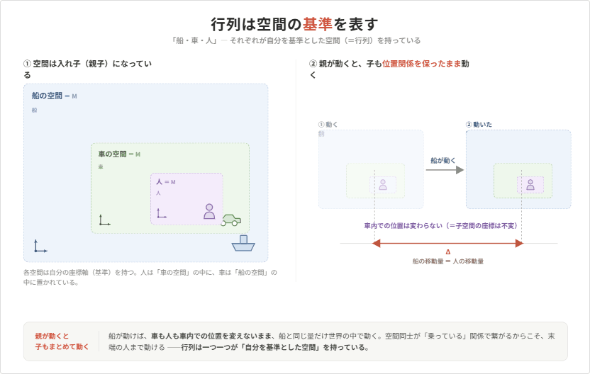

# **座標変換**

---

行列を利用するとベクトルの移動、回転、拡縮を一括で計算できる。  
更に行列同士を乗算（合成）する事で「ある物を別の物に追従させる」など、  
特殊な位置関係の計算に役立つ例も挙げた。

これらは総称して**座標変換**と呼ばれる。  
まずは行列がどのように座標変換に寄与するのかを再度イメージする。

---
## **行列は空間の基準を表す事が出来る**

「ある物を別の物に追従させる」という例を挙げた。  
例えば「人を乗せて動く車」をイメージしてほしい。

車が動く事で、結果的に乗っている人が移動した事になっている。  
重要なのは**人自体は動いておらず、車内でその人の位置は変わっていない**という点。

車の中には「車の中の空間」があり、その中で人は移動していない。  
ところが**車自体が動く事で「車の中」にいる人の位置も変わっていく**。  

更に「車に乗ったままフェリーに乗る」と、今度は  
「船の中」にいる車も「車の中」にいる人も一切動かなくても、  
船自体が動く事で、両方の位置が変わっていく。

つまり船、車、人がそれぞれ「自分の空間」を持っており、  
空間同士が「乗っている」という状況で繋がっているからこそ、  
**「船」が動くだけで末端にいる「人」が移動する事が出来る**。

これらの「自分の空間」は行列で表す事が可能。  
各物がその行列を持つ事によって**自分を基準とした空間を表せる**様になる。  

---
## **空間同士での位置関係を計算できる**

この部屋にはドアがあるが、自分から見てドアはどの位置にあるか考える。  
 
見る人の向きや位置によって、  
 **その人を基準にした「ドアまでの方向や距離」も変わる**。   
単純な「距離」であれば座標の差を計算するだけでいいが、  
**見る人の向きと位置を基準にしたベクトル**は単なる座標の差で計算する事は難しい。  
ところが行列を用いる事で容易になる。

「ある行列」を基準として他の物の位置関係を知る為に逆行列を利用する。

「Aを基準とした空間」を作る事で「A」から見た位置関係が計算しやすくなる。  
「Aを基準とした空間」は、Aの逆行列を周りの別オブジェクトにかけ合わせる事で作る事が出来る。

---
## **座標変換**

各々の空間を表す行列を合成しあう事により、各空間毎で  
- **各物がどのような位置や向きにあるべきなのか**  
- **各物がどのような位置関係にあるのか**  

を表す事が出来る。

この計算こそが**座標変換**となる。

3D アプリケーション作成においては、あらゆる所で座標変換が用いられる。  
しっかりイメージ出来るようにしておいてほしい。

