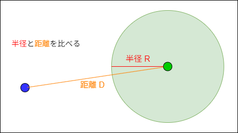
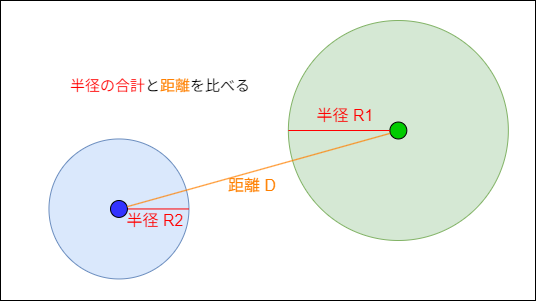
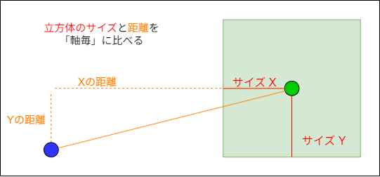
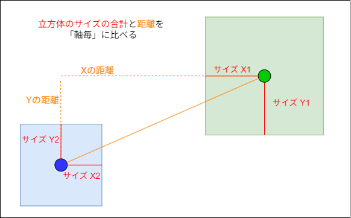
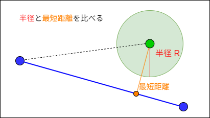
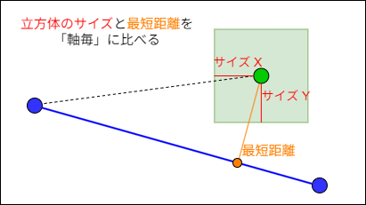

# **衝突判定**

ゲームにおいて、物を移動させる事はこれまでの内容で概ね実現できる。  
ただ、当然動くだけならゲームにはならない。

3D のアクションゲームを作っていると考えると、

- ジャンプして高低差のある地面に着地する
- 壁に当たって先に進めない
- 敵の攻撃を受ける
- 敵に攻撃を与える

などなど、ゲームに登場するオブジェクト同士が干渉しあう事によって、  
何らかの変化を与える挙動が必要になってくる。

そこで必要になるのが  **当たり（衝突）判定** 。

ゲーム内で動かしているオブジェクト同士が当たっているか、  
言い方を変えると「オブジェクト同士が重なっているか」を判定する処理を用意する事で、  
先程挙げたような事が実現出来る。

---
## **衝突判定の注意点**

当たり判定を入れるだけで、一気にゲームらしさが出てくる。  
それだけ重要で必要不可欠な物なのだが注意する点もある。  
それは**処理負荷が高くなりがち**という事。  

例えばオープンワールドのゲームを作る事を考えた際、  
まず広大で複雑な地形や壁が存在しており、  
その上、敵やNPC、壊れるオブジェクト等も大量に登場している。  
それらオブジェクトは地形に沿って動作しなければならい為、  
大量のオブジェクト一つ一つが広大で複雑な地形と当たり判定をとっている事が分かると思う。  
その上、大量のオブジェクト同士も互いに当たり判定を取れる様にしなければならない。

しかしこれらを全て素直に判定していくと、判定の数が多すぎてまともに動作出来なくなる。  

オープンワールドでなくても、ゲームを作っていると当たり判定回数は多くなりがち。  
一つ一つの判定の計算量も多く、数の暴力も相まって処理負荷が高くなってしまう事が多い。

---
## **様々な形状同士の衝突**

「オブジェクト同士が重なっている」をどう判定するのかだが、  
**その判定方法は多岐にわたる**。  

「各オブジェクトを単純な形状に置き換え、その形状同士で判定を取る」方法もあれば、  
「オブジェクトの形状その物同士で判定を取る」方法もある。  
前者は大雑把な判定になるが、後者はかなり細かい判定になる事はわかると思う。

単純な形状に置き換える場合でも、様々な組み合わせがある。

単純な計算で済む物から、複雑な計算が必要になる物まで色々とある。  
当たり判定や衝突処理を用意する際、自分の作りたいゲームの内容に合わせて、  

-  どの程度細かい判定を取りたいのか   
-  各オブジェクトをどういった形状に置き換えて判定するのか  

などを考える必要がある。

---
## **形状毎の衝突判定方法**

形状によって判定の方法は異なる。  
幾つか例を挙げる。

### **球と点**

基本的に「球の中心から点までの距離」で判定する。  
距離が球の半径より小さければ衝突しているといえる。

### **球と球**

基本の考え方は**球と点**と同様。  
但しこちらは球同士の為、  
「双方の半径の合計」を衝突判定距離に利用する。

### **立方体と点**

「立方体の中心と点までの距離」をまず計算する事は同じ。

だが立方体は球と違い、辺毎に距離に違いがある為、判定は辺毎に行う必要がある。  
距離の X、Y、Z それぞれが、立方体サイズの X、Y、Z を下回っていれば衝突しているといえる。

### **立方体と立方体**

**立方体と点**と考え方は同様。

ただしこちらも立方体同士のため、  
双方の立方体サイズの X 同士、Y 同士、Z 同士の合計で判定する。

### **線と球**

基本として抑えておくべきものは二つ。  

-  球の中心から線までの最短距離はいくらか 
-  球が線の始点と終点の範囲にいるかどうか 

球の中心から線までの最短距離に関しては、  
「内積と外積」の時間で説明したと思う。

二つのベクトルがあり、片方のベクトルを単位化し、  
別ベクトルを **射影** する事によって、  
最短距離となる位置がわかるという物。  
これを計算すれば、球が線の延長線上にいるかどうかは判定できる。
線が「無限遠」の場合はここまでの判定のみで問題ない。  

ただ「範囲がある線」つまり「線分」の場合だと不十分。

というのも前述の計算では「延長線上にいるかどうか」しかわからない。  
その為、最短位置を計算する際に「その最短位置が線分の範囲内かどうか」も計算に含めなければならない。

### **線分と立方体**

球ではなく立方体の場合も同じやり方で判定をとれる。  
重要なのは **線分までの最短距離となる位置を探す事** 。 

---
## **衝突判定方法の選択**

シューティングゲームを作るとした場合、  
どの様な衝突判定が必要か考える。

- プレイヤーが発射する弾はプレイヤーの向きに真直ぐ飛ぶ
- プレイヤーの機体が敵に当たるとプレイヤーが死ぬ
- プレイヤーの発射した弾が敵に当たると敵が死ぬ
- プレイヤーが発射する弾に当たる予定の敵を赤くする

どんなゲームを作りたいか、どんな仕様があるのかによって、  
必要な衝突判定は変わってくる。

---
今回挙げている組み合わせだけで、  
全ての衝突判定が賄えるようなゲームは少ない。  

- 傾いた立方体（OBB）との衝突判定
- 面（ポリゴン）との衝突判定

など、もっと複雑な衝突判定が自然と必要になってくる。  
そして複雑になればなるほど処理負荷も跳ね上がる。

また、球同士などでも  
「衝突した表面位置の計算」  
「どの向きにどんな大きさで反発するか」  
など、より細かな情報が必要になる事も多い。

基本として、まずここで挙げた内容を抑えておき、  
その発展として、色々な方法を調べてみてほしい。