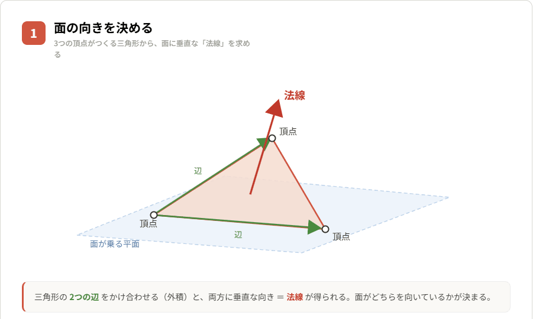
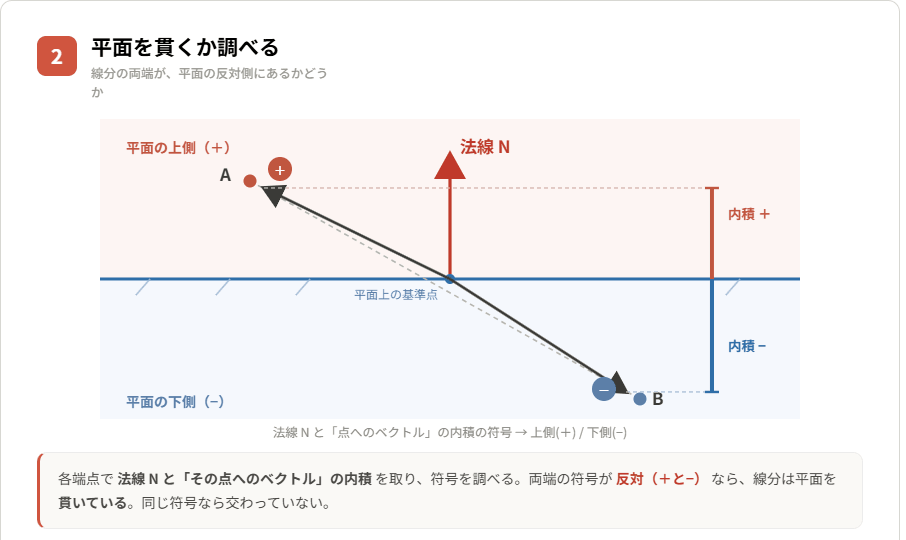
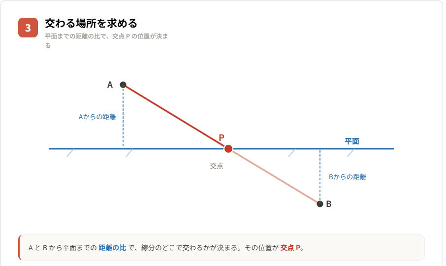
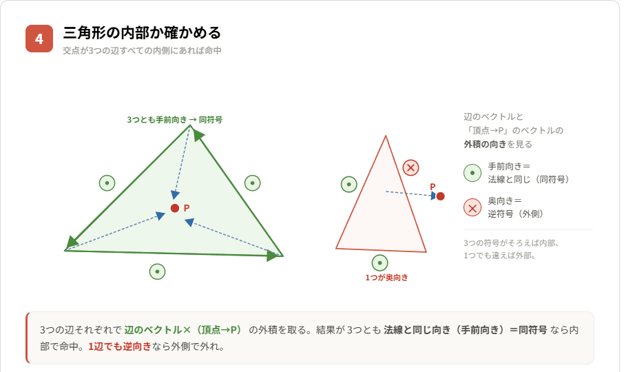

# **ポリゴンと線分の衝突**

---

衝突１では、球や立方体といった単純な形状同士の衝突を扱った。  
その発展として、今回は **ポリゴン（面）と線分の衝突** を取り上げる。

3D のモデルや地形は、突き詰めると大量の **ポリゴン** の集まりで出来ている。  
その為「ポリゴンと線分の衝突」を計算できると、  
「壁（面）に弾（線分）が当たったか」「地面まで視線が届くか」といった、  
より現実的で細かい判定が実現できるようになる。

線分は、弾の軌道や視線（レイ）を表す物として頻繁に登場する。  
まずはポリゴンそのものの復習から入る。

---
## **ポリゴンとは**

ポリゴンとは **頂点を結んで作られる面** を指す。  
3D では三つの頂点で作る **三角形** が基本単位となる。

三角形のポリゴンは、次の情報を持っている。

- 三つの頂点 $V_{0}, V_{1}, V_{2}$
- 頂点が乗っている一枚の 平面 
- 面が向いている方向を表す 法線 

 **法線** とは、面に対して垂直なベクトルを指す。  
「内積と外積」で触れた通り、法線は **外積** で求められる。

$$\vec{N} = (V_{1}-V_{0})\times(V_{2}-V_{0})$$

二辺のベクトルの外積を取る事で、両方に直交する=面に垂直なベクトルが得られる。  
以降の計算では、この法線 $\vec{N}$ を単位ベクトルにして利用する。

---
## **判定の考え方**

「線分がポリゴンを貫いているか」は、次の二段階に分けて考える。

1. **線分がポリゴンの乗る平面を貫くか**
2. **その貫いた位置がポリゴンの内部にあるか**

面は、無限に広い平面の一部を切り取った物と捉えられる。  
その為、まず **無限に広い平面との交点** を求め、  
次に **交点が三角形の内側かどうか** を確かめる、という順序になる。

---
## **線分と平面の交点**

### **平面の表現**

平面は平面上の一点 $P_{0}$ と法線 $\vec{N}$ があれば表せる。  
頂点 $V_{0}$ を $P_{0}$ として利用すればいい。

平面上の任意の点 $P$ は、法線との関係で次の式を満たす。

$$\vec{N}\cdot(P - P_{0}) = 0$$

$\vec{N}\cdot(P - P_{0})$ は、点 $P$ から平面までの **符号付き距離** を表す。  
これは「内積で射影を計算する」考え方そのものになる。  
値が 0 なら平面上、プラスなら法線側、マイナスなら反対側にいる、といえる。

### **線分が平面をまたぐか**

線分の両端 $A$、$B$ について、それぞれ符号付き距離を計算する。

$$d_{A} = \vec{N}\cdot(A - P_{0})$$
$$d_{B} = \vec{N}\cdot(B - P_{0})$$

二つの符号が **異なっていれば** 、  
線分は平面を挟んで反対側に伸びている、つまり平面を貫いているといえる。  
式にすると $d_{A}\times d_{B} < 0$ が貫通の条件になる。

同符号の場合は両端が平面の同じ側にあり、交わっていない。

### **交点の計算**

貫いている場合、交点は $A$ から $B$ に向かう線分を、  
符号付き距離の比で内分した位置になる。  
内分の割合 $t$ は下記の式で計算できる。

$$t = \frac{d_{A}}{d_{A} - d_{B}}$$

この $t$ を使い、交点 $P$ は次の式で求まる。

$$P = A + t(B - A)$$

$t$ は 0 〜 1 の値になり、$A$ からどれだけ進んだ位置で平面と交わるかを表す。

### **別解：単位ベクトルと角度で求める**

同じ交点は、 **A から平面への最短距離** と **線分の向き** だけでも求められる。  
レイ（始点と方向で表す線）と結び付けやすい考え方になる。

まず線分の向きを単位ベクトル $\hat{u}$ にする。

$$\hat{u} = \frac{B - A}{|B - A|}$$

A から平面への最短距離は、既に計算した符号付き距離 $d_{A}$ そのものになる。  
一方で、単位ベクトル $\hat{u}$ を法線方向に射影した値を求める。

$$dx = \vec{N}\cdot\hat{u}$$

この $dx$ は **進行方向と法線のなす角の $\cos$** を表す。  
最短距離 $d_{A}$ は「法線方向に真っすぐ測った距離」だが、  
線分は斜めに進む為、実際に進む距離はその分だけ長くなる。  
斜めの分を $dx$ で割って引き伸ばす事で、線分に沿って進む距離 $s$ が求まる。

$$s = -\frac{d_{A}}{dx}$$

これを単位ベクトルに乗算して A に加えると、内分で求めた時と同じ交点にたどり着く。

$$P = A + s\hat{u}$$

直角三角形で例えると、最短距離 $d_{A}$ が 隣辺 、  
進む距離 $s$ が 斜辺 の関係になる。  
なお $dx$ が 0 の場合は線分が平面と平行で交わらない為、割り算の前に除外しておく。

---
## **交点がポリゴンの内部か**

交点 $P$ は、あくまで **無限平面上の位置** でしかない。  
三角形の外側で平面と交わっている場合もある為、  
$P$ が三角形の内側にあるかどうかを別途確かめる必要がある。

ここでも **外積** が役に立つ。  
三角形の各辺について、辺のベクトルと「辺の始点から $P$ に向かうベクトル」の外積を取る。

$$\vec{C_{0}} = (V_{1}-V_{0})\times(P - V_{0})$$
$$\vec{C_{1}} = (V_{2}-V_{1})\times(P - V_{1})$$
$$\vec{C_{2}} = (V_{0}-V_{2})\times(P - V_{2})$$

外積は「二つのベクトルが作る面の向き」を表していた。  
$P$ が辺の内側にあれば、外積の向きは面の法線 $\vec{N}$ と **同じ向き** になる。  
外側にあれば逆向きになる。

その為、三つの外積すべてが法線と同じ向き  
（それぞれと $\vec{N}$ の内積が正）であれば、  
交点は三角形の内部にあるといえる。  
一つでも逆を向いていれば、交点は三角形の外側にあると判断する。

---
## **まとめと注意点**

ポリゴンと線分の衝突は、これまで学んだ **内積・外積・射影** の組み合わせで実現できる。  
流れを整理すると次のようになる。

- 外積で面の法線を求める
- 内積（符号付き距離）で線分が平面を貫くか判定する
- 内分比から交点を計算する
- 外積で交点が三角形の内側かを判定する

この判定は**レイキャスト**（線を飛ばして物に当てる処理）の基礎にもなる。  
弾の当たり判定や視線判定、地面へのめり込み補正など、応用範囲は広い。

一方で、モデル一つは大量のポリゴンで出来ている為、  
全ポリゴンと総当たりで判定すると処理負荷が跳ね上がる。  
実際には、まず球や立方体といった単純な形状で大まかに絞り込み、  
本当に近い物だけをポリゴン単位で精密に判定する、といった工夫が欠かせない。
