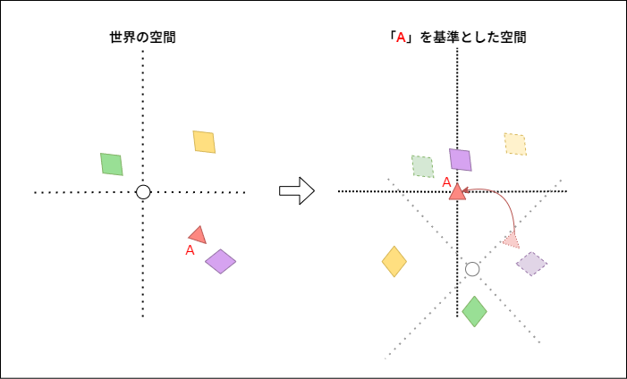

# **座標変換**

行列を利用するとベクトルの移動、回転、拡縮を一括で計算出来る事はお話した。  

更に行列同士を乗算する事で「ある物を別の物に追従させる」など、  
特殊な位置関係の計算に役立つ例も挙げた。

今回はその行列を利用した**座標変換**を取り上げる

---
## **行列は空間の基準を表す**

「ある物を別の物に追従させる」という例を挙げた。  
例えば「人を乗せて動く車」をイメージしてほしい。

車が動く事で、結果的に乗っている人が移動した事になっている。  
重要なのは「人自体は動いておらず、車内でその人の位置は変わっていない」という点。

車の中には「車の中の空間」があり、その中で人は移動していない。  
ところが車自体が動く事で「車の中」にいる人の位置も変わっていく。  

更に「車に乗ったままフェリーに乗る」と、今度は  
「船の中」にいる車も「車の中」にいる人も一切動かなくても、  
船自体が動く事で、両方の位置が変わっていく。

つまり船、車、人がそれぞれ「自分の空間」を持っており、  
空間同士が「乗っている」という状況で繋がっているからこそ、  
末端にいる「人」が移動する事が出来る。

これらの「自分の空間」は行列で表す事が可能。
行列は**一つ一つが自分を基準とした空間**を持っている。  

---
## **ある基準から見た位置関係の計算**

もう一つイメージの為の例を挙げる。  
この部屋にはドアがある。  
皆さんの目から見て、ドアはどの位置にあるか？  
後ろ方向に〇メートル、みたいな答えになると思うが、  
自分から見ると前方向に△メートルとなる。  
 
当たり前だが見る人の向きや位置によって、  
 **その人を基準にした「ドアまでの方向や距離」も変わる**。   
単純な「距離」であれば座標の差を計算するだけでいいが、  
**見る人の向きと位置を基準にしたベクトル**は単なる座標の差で計算する事は難しい。  
ところが行列ならそれが可能。

「ある行列」を基準として他の物の位置関係を知る為に逆行列を利用する。

「Aを基準とした空間」を作る事で「A」から見た位置関係が計算しやすくなる。  
「Aを基準とした空間」は、Aの逆行列を周りの別オブジェクトにかけ合わせる事で作る事が出来る。

---
## **Sampe 1**

行列を合成する事で **ある空間の物を別の空間に繋げて動かす事ができる**  。

矢印は A と S で回転し、十字キーで矢印が向いている方向を基準に移動する事が出来る。  
その状態で Z を押すと、矢印がどんな向き、位置にいても、矢印の先に球が引っ付く。  
 **矢印の行列を、球の位置の計算に利用している** 。  

 **球が矢印の座標や回転を細かく把握する必要は無い** 。  
矢印基準の空間を表す行列があるなら、それを利用するだけで矢印に引っ付ける事が可能。

---
## **Sample 2**

行列を利用する事で、位置関係が計算しやすくなる例を挙げる。  

緑の矢印と赤のキューブがある。  
動かしてもらうと二つテキストが表示される。  
一つは単なる位置の差ベクトルを計算しているが、  
もう一つは「緑の矢印を基準にした、赤までのベクトル」を計算しているのがわかるだろうか。

**「○○からみたxxの位置」**は、
基準となる行列があれば計算出来る。 

---
## **Sample 3**

実行すると、矢印の方向にいる球のみが赤くなる。  

矢印の位置や回転を考慮した上で「球が矢印の前方にいる」を判定するのは結構な手間になるが  
**矢印の逆行列と行列の合成を利用する** 事で簡単に判定が可能になる。

**ある基準から見た位置関係の計算** の項目で説明した内容通り、  
**矢印基準の空間に全ての球を持ってくる**。  
その結果、矢印基準の空間において、球の位置の Z が + なら、その球は「矢印の前方にいる」と言える。

---

これらが <strong> 座標変換 </strong> の基礎となる。  
今後3Dゲームを作成する上で避けては通れないので、今の内に概念をしっかり理解しておいてほしい。

