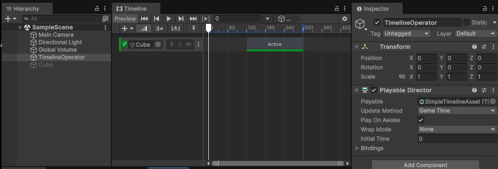
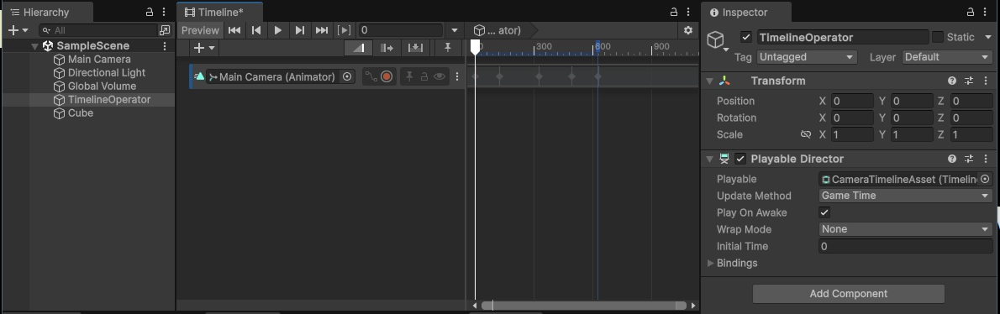

# **Timeline**

---

## **Timelineとは**

Unity 6 に標準搭載されている**シーケンス制御ツール**。  
Timeline はアニメーションやオーディオ、カメラ切り替えやイベント発火などを、  
**時間軸上に直感的に配置して制御できる**。  

UnrealEngine にも同様の仕組みがあり、あちらでは **Sequencer** と呼ばれている。

主な用途は以下の通り。  

- カットシーンや演出の作成  
- アニメーションとオーディオの同期  
- 複数コンポーネントの同時制御  
- ゲーム進行に連動した演出の実現  

Timeline は**演出・時間制御のための編集ツール**であり、  
ゲームロジックを構築する仕組みではない。  
そのため Visual Scripting や C# スクリプトと組み合わせて  
利用することが多い。  

---

## **Playable**

Timeline の実装には `Playable` というキーワードが頻繁に登場する。  
それぞれ混乱しやすい為、まずは簡単なイメージを掴んでおいてほしい。


| 名称                    | 役割                      | 補足                       |
| --------------------- | ----------------------- | ------------------------ |
| `Playable`          | 再生の最小単位（ノード）            | 「再生」という動作を取れる物の基底処理 |
| `PlayableAsset`     | Playable をシリアライズしたアセット | 「再生」を表すデータの基礎部分   |
| `PlayableBehaviour` | 実際の挙動・処理                | 「再生中に何をするか」はここで決まる      |
| `PlayableGraph`     | Playable 同士をつないだネットワーク  | Playable をどの順序で、どう合成するかを決める   |
| `PlayableDirector`  | グラフ全体の再生管理者             | Timeline コンポーネントがこれにあたる  |


---

## **Timeline の編集準備**  

### **Timelineアセットの作成**

1. プロジェクトビューで右クリックし `Create` → `Timeline` を選択する  
2. Timeline アセットを作成し、名前を付ける  
3. シーンに GameObject を配置して `Playable Director` コンポーネントを追加する
4. インスペクターで Playable Director の `Playable` にアセットを割り当てる  

### **Timelineウィンドウの起動**

1. メニューから `Window` → `Sequencing` → `Timeline` を開く  
1. Playable Director を追加した GameObject を選択すると Timeline ウィンドウに内容が表示される  

### **トラックの追加**

1. Timeline 上で右クリックして、必要な**トラック**を追加する  
    - `Activation Track`：GameObject ON/OFF 制御用トラック  
    - `Animation Track`：アニメーション制御用トラック
    - `Audio Track`：BGM や SE 制御用トラック  
    - `Signal Track`：様々な情報の設定通知用トラック 
    - `Control Track`：クリップに配置するオブジェクトの種類によって挙動が変化するトラック 
    - `Playable Track`：C# で独自に用意したオブジェクト制御用トラック 

### **クリップの操作**

- 各トラックに対応するクリップを配置
    - トラック上で右クリックでクリップ新規作成 or すでにアセットとして存在しているクリップ
- Timeline 上で位置と長さを調整
- 再生ボタンでシーン内の挙動を確認可能

---

## **基本操作例**

### **Cube の ON/OFF**

1. Timeline アセットを作成し、**SimpleTimelineAsset** などの名前を付ける
1. シーンに GameObject を配置し、**TimelineObject** などの名前を付ける
1. **TimelineObject** に `Playerble Director` コンポーネントを追加する
1. **TimelineObject** に 1. で作成した Timeline アセットを紐づける
1. Timeline  ウィンドウで `Activation Track` を追加する
1. シーンに Cube を配置する
1. Cube を `Activation Track` の項目にドラッグアンドドロップ
1. `Activation Track` 上で右クリックし、`Add Activation Clip` を選択する
1. 配置された `Activation Clip` の開始位置を後ろにずらす
1. シーンを保存して再生する




### **カメラ操作**

1. Timeline アセットを作成し、**CameraTimelineAsset** などの名前を付ける
1. シーンに GameObject を配置し、**TimelineObject** などの名前を付ける
1. **TimelineObject** に `Playerble Director` コンポーネントを追加する
1. **TimelineObject** に 1. で作成した Timeline アセットを紐づける
1. シーンに Cube を配置する(カメラの変化を把握する為)
1. Timeline  ウィンドウで `Animation Track` を追加する
1. Main Camera を `Animation Track` の項目にドラッグアンドドロップ
1. Main Camera 紐づけた隣にある**赤い丸**をクリックして**レコーディング状態にする**
1.  Timeline の進行をスライドしつつ、カメラの位置や角度を変える
1. 編集が終わったら**赤い丸**をクリックして**レコーディング状態を解除する**
1. シーンを保存して再生する



#### **補足**

サンプルではシンプルなカメラ操作しかしていない。  
演出で使うようなカメラはもっと様々な制御が必要になる。

よりカットシーンに適したカメラ操作を行えるように、  
Unity では `Cinemachine` というパッケージが存在している。

**Window > PackageManager** で追加インストールすれば利用できる。  


---

## **その他の実用的な使い方**

### **キャラクターのアニメーション**

Animation Track に Animator をバインドし、モーションを並べる。  
Timeline 上で繋ぐことで、自然な演技を作りやすい。  

### **イベントの発火**

Signal Track を利用して任意のタイミングでスクリプトやエフェクトを呼び出せる。  
時間経過に合わせた爆発エフェクト or UI 表示などの演出に有効。  

---

## **Timelineとスクリプトの連携**

Timeline の再生タイミングはスクリプトから制御可能。  

下記のスクリプトコードを作成して、  
基本操作例「Cube の ON/OFF」で作成した `TimelineObject` オブジェクトに追加する。

```csharp
using UnityEngine;
using UnityEngine.Playables;

public class TimelineController : MonoBehaviour
{
	private PlayableDirector director_; // PlayableDirector コンポーネントを保持するフィールド

	/// <summary>
	/// 起動
	/// </summary>
	void Awake()
	{
		director_ = GetComponent<PlayableDirector>(); // PlayableDirector コンポーネントを取得
	}

	/// <summary>
	/// 開始
	/// </summary>
	void Start()
	{
		director_.Stop();  // Timeline 停止
	}

	/// <summary>
	/// 更新
	/// </summary>
	void Update()
	{
		if (Input.GetKeyDown(KeyCode.A))
		{
            director_.time = 0;
			director_.Play();   // Timeline 再生
		}
		if (Input.GetKeyDown(KeyCode.Z))
		{
			director_.Pause();  // 一時停止
		}
	}
}
```

再生時にすぐに Timeline が動作せず、  
A ボタン押下で動き出す事が確認できる。

何かのタイミングをきっかけに演出を開始する場合は、  
こういったスクリプトなどから制御するのが一般的。

---

## **動的生成オブジェクトを演技させる**

通常 Timeline は事前に配置された GameObject にしか対応しない。  
しかし敵キャラや NPC をランタイムで生成し、  
そのまま演技させたい場合もある。

その際には **動的なバインド（紐付け）** が必要となる。  

### **動的なバインドの実装例**

1. Timeline アセットを作成し `ActivationTrack Track` を追加してクリップを配置
    - **何もバインドしない状態にしておく**
1. これまで同様に `TimelineObject` オブジェクトをシーンに配置
1. `TimelineObject` オブジェクトに `Playable Director` コンポーネントを追加
2. `TimelineObject` オブジェクトの `Playable` に 1. で作成した Timeline アセットを設定
1. 下記のスクリプトコードを `TimelineObject` オブジェクトに追加

```csharp
using UnityEngine;
using UnityEngine.Playables;
using UnityEngine.Timeline;

public class DynamicBind : MonoBehaviour
{
	private PlayableDirector director_;     // PlayableDirector コンポーネントを保持するフィールド
	private GameObject       targetObject_; // 動的にバインドするオブジェクトを保持するフィールド

	/// <summary>
	/// 起動
	/// </summary>
	void Awake()
	{
		director_ = GetComponent<PlayableDirector>(); // PlayableDirector コンポーネントを取得
	}

	/// <summary>
	/// 開始
	/// </summary>
	void Start()
	{
		director_.Stop();  // Timeline 停止
	}

	/// <summary>
	/// 更新
	/// </summary>
	void Update()
	{
		// A キーで Cube、Z キーで Sphere を生成する
		Object obj = null;
		if (Input.GetKeyDown(KeyCode.A))
		{
			obj = GameObject.CreatePrimitive(PrimitiveType.Cube);
		}
		else if (Input.GetKeyDown(KeyCode.Z))
		{
			obj = GameObject.CreatePrimitive(PrimitiveType.Sphere);
		}

		// オブジェクトが生成されたらバインドして再生
		if (obj)
		{
			// 既存のオブジェクトがあれば削除
			if (targetObject_)
			{
				Destroy(targetObject_);
			}
			// 生成したオブジェクトを保持
			targetObject_ = (GameObject)obj;


			// PlayableDirector の TimelineAsset を取得する
			var timelineAsset = (TimelineAsset)director_.playableAsset;

			// TimelineAsset の全ての Track を調べる
			foreach (var track in timelineAsset.GetOutputTracks())
			{
				// track が ActivationTrack かどうかを調べる
				if (track is ActivationTrack)
				{
					// ActivationTrack なら動的に生成したオブジェクトをその Track にバインドする
					director_.SetGenericBinding(track, targetObject_);
				}
			}

			// 再生位置を先頭に戻して再生
			director_.time = 0;
			director_.Play();
		}
	}
}
```

ゲーム開始後、A ボタン or Z ボタンのどちらを押下するかで、  
演技対象のオブジェクトが変化する。

### **活用例**

- 敵キャラを戦闘前に登場させ、演技とカメラワークを同期  
- NPC をイベント開始時に生成し、会話演出を自動化  
- プレイヤーのスキンや装備を反映したカットシーンを自動生成  

<span style ="color: red;">**動的なバインドで、演出の再利用性と柔軟性が大きく向上する**</span>。  

---

## **C# スクリプトで独自に作成する Playable Asset**

ゲームを作成していると、アニメーションやサウンドなどの標準的なトラック制御ではなく、  
ゲーム独自の「自作した挙動」を Timeline に沿って動作させたい場合が出てくる。

トラック毎に配置できるクリップの種類は決まっている為、  
本来は「独自の挙動」をトラックにクリップとして配置する事は出来ない。

だが **`Playable Asset を継承した独自の Asset`** を用意し、  
`Playable Track` に配置する事でそれが可能になる。

#### **自作 Playable Asset の実装例**

下記は「ライトを Timeline 上で独自に制御する PlayableAsset」の実装になる。

```csharp
using System.Drawing;
using UnityEngine;
using UnityEngine.Playables;

/// <summary>
/// ライトを Timeline 上で独自制御する為の PlayableAsset
/// </summary>
[System.Serializable]
public class LightPlayableAsset : PlayableAsset
{
	public UnityEngine.Color color_ = UnityEngine.Color.white;   // ライトの色
	public float intensity_ = 1.0f; // ライトの強度

	/// <summary>
	/// Playable を生成する
	/// Timeline 再生開始時に呼び出される
	/// </summary>
	public override Playable CreatePlayable(PlayableGraph graph, GameObject owner)
	{
		// 独自に作成した「LightPlayableBehaviour」 を持つ Playable を生成
		// ScriptPlayable を介する事で「独自作成の PlayableBehavior」を PlayableGraph に組み込む事ができる
		var playable = ScriptPlayable<LightPlayableBehaviour>.Create(graph);

		// LightPlayableBehaviour に初期パラメータを設定する
		var behaviour = playable.GetBehaviour();
		behaviour.color_ = color_;
		behaviour.intensity_ = intensity_;

		// 生成した Playable を返す
		return playable;
	}
}

/// <summary>
/// ライトの色と強度を Timeline に合わせて具体的に変化させる為の Playable Behaviour
/// LightPlayableAsset 内で生成される
/// </summary>
public class LightPlayableBehaviour : PlayableBehaviour
{
	public UnityEngine.Color color_;     // ライトの色
	public float intensity_; // ライトの強度
	private Light light_;    // シーン内のライト

	/// <summary>
	/// 再生開始時の処理を行う
	/// トラック上でクリップが再生されると呼び出される
	/// </summary>
	public override void OnBehaviourPlay(Playable playable, FrameData info)
	{
		// シーン内のライトを取得
		light_ = Object.FindFirstObjectByType<Light>();
		if (light_ == null) { return; }

		// LightPlayableAsset で設定された色と強度をライトに適用する
		light_.color = color_;
		light_.intensity = intensity_;

	}

	/// <summary>
	/// 再生中の毎フレームの処理を行う
	/// トラック上でクリップが再生されている間、毎フレーム呼び出される
	/// </summary>
	public override void PrepareFrame(Playable playable, FrameData info)
	{
		// 例えば、ここでライトの色や強度を時間に応じて変化させる事も可能
	}

	/// <summary>
	/// 再生終了時の処理を行う
	/// トラック上でクリップの再生が終了すると呼び出される
	/// </summary>
	public override void OnBehaviourPause(Playable playable, FrameData info)
	{
		if (light_ == null) { return; }

		// ライトの色と強度を元に戻す
		light_.color = UnityEngine.Color.white;
		light_.intensity = 1;
	}
}
```

Timeline で `Playable Track` を追加し、このスクリプトをクリップとして直接配置すると、  
ライトの色と強さをクリップ選択時のインスペクターから編集できるようになる。

編集後にゲームを再生して Timeline を再生すると、  
ライトの色や強さが Timeline の進行に合わせて変化する事を確認できる。

---

## **まとめ**

- Timeline は「時間に合わせた様々な制御」を行う  
- `Playable` という「再生」を表す情報を組み合わせて一つの演出を作成できる  
- トラック、クリップといったキーワードの把握が重要  
- 独自実装を配置できるなど、様々なカスタマイズが可能