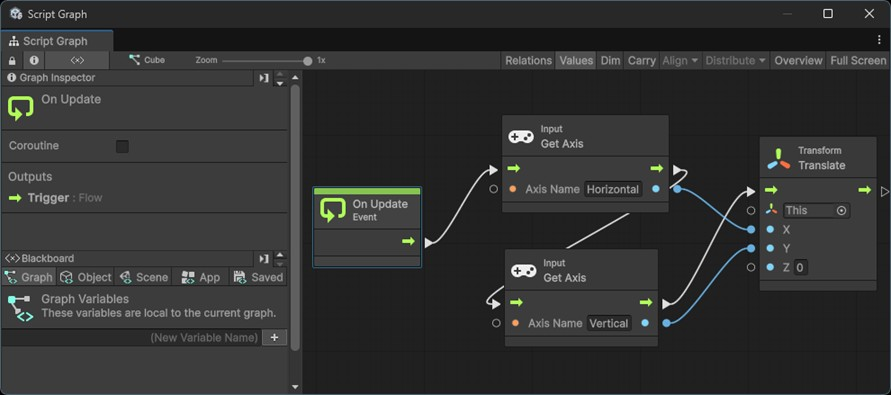
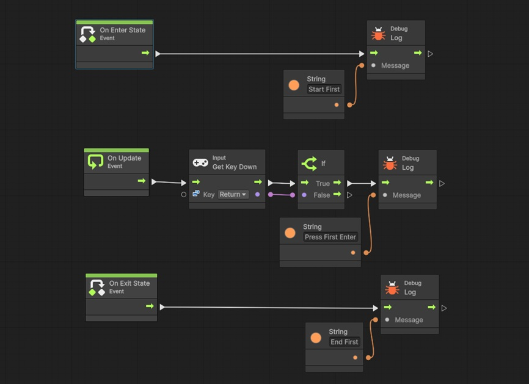
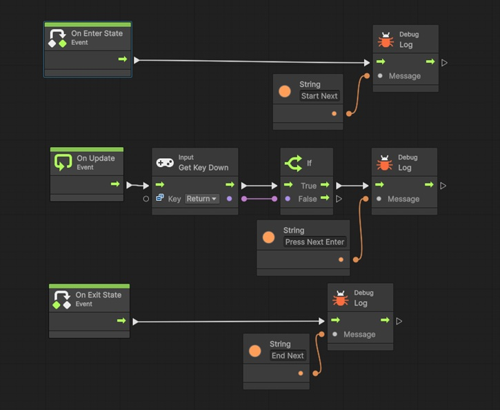
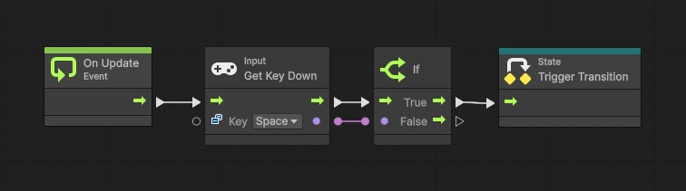
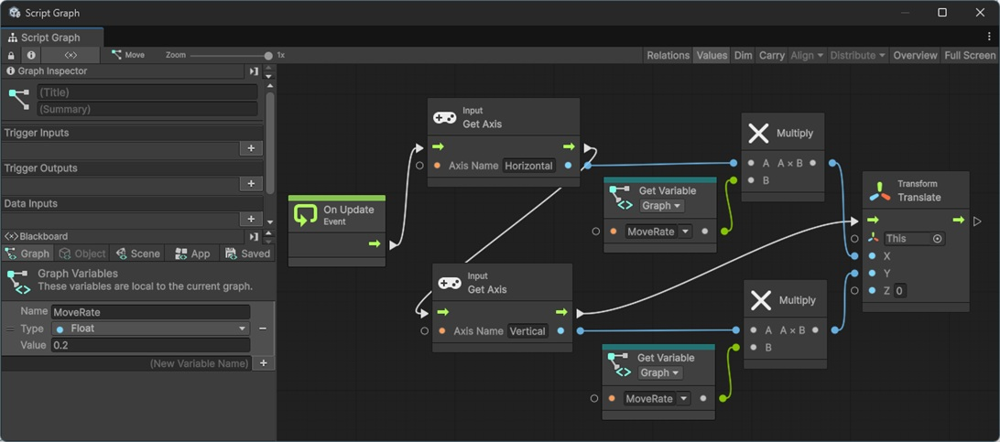
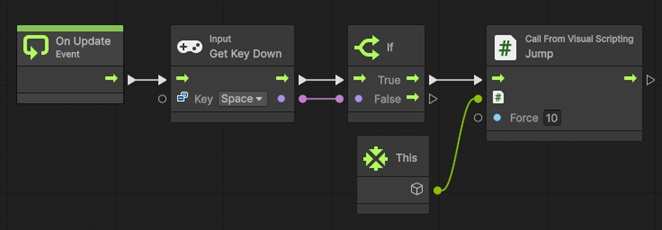

# **Visual Scripting**

---

## **Visual Scripting の概要**

Visual Scripting は Unity に標準搭載されたノードベースの開発環境。  
コードを書かずに処理を組み立てられるため、プログラミング初心者やデザイナーでも  
ゲーム挙動を直感的に構築できる。  

処理は「ノード」と呼ばれる部品を線でつなぐことで表現する。  
従来は C# スクリプトを書かないと作れなかった機能を視覚的に実装できる点が強み。  
Unity 6 からは追加インストール不要で利用可能になり、標準ワークフローに組み込まれている。  

<span style ="color: red;">**プログラム構造を視覚的に理解できる点が最大の利点**</span>  
初心者教育からチーム開発まで幅広く利用可能。  

---

## **Graph の種類と特徴**

### **Script Graph**

逐次処理をノードで構成する仕組み。  
ゲームループやイベントを入口に、条件分岐や数値演算を直列に接続する。  
代表的な利用例は入力判定や移動処理であり、C# における if 文や while 文の代替になる。  

例として Update イベントから Input.GetAxis を取得し、Transform.Translate へ接続すれば  
キーボード入力による移動処理を実現できる。  

### **State Graph**

状態の管理に特化した仕組みである。  
Idle、Walk、Jump のような状態をノードとして定義し、条件に応じて遷移する。  
これは有限状態機械（Finite State Machine）の概念に基づいており、キャラクター AI や  
ゲーム進行の管理に適している。  

### **用途の違い**

| 種類 | 特徴 | 用途 |
|------|------|------|
| Script Graph | 処理を逐次的につなげる | 入力、物理演算、UI 更新 |
| State Graph | 状態と遷移を表す | キャラクター挙動、進行管理 |

---

## **Blackboard**
 
複雑な処理をノードで組み立てる場合、  
ノード上で利用できる「変数」が必要になってくる。

Visual Scripting では **Blackboard** と呼ばれる物で、  
必要な各変数を管理する。  

ソースコード上で変数宣言するのと同じイメージで問題ない。  
「コード上で行う変数宣言を Graph 編集画面でも行う事が出来る」と覚えておいてほしい。

---

## **基本操作例**

### **デバッグログ表示**

1. シーンに `GameObject` を配置する  
2. `GameObject` に `Script Machine` コンポーネントを追加する  
3. `Script Machine` の「new」を選択し、新しい `Script Graph` を割り当てる  
3. `Edit Graph` を押下
4. `Script Graph Editor` 上で右クリックして下記のノードを追加する
    - `Debug.Log`  
    - `String Literal`
5. 下記の順にノードを繋げる
    - `On Start` → `Debug.Log`  
    - `String` → `Debug.Log（Message）`
6. `String` に任意の文字列を記入
7. 再生するとコンソールに文字列が出る


### **Cube 操作**

1. シーンに `Cube` を配置する  
2. `Cube` に `Script Machine` コンポーネントを追加する  
3. `Script Machine` の「new」を選択し、新しい `Script Graph` を割り当てる  
3. `Edit Graph` を押下
4. `Script Graph Editor` 上で右クリックして下記のノードを追加する
    - input.GetAxis を二つ  
    - transform.Translate   
5. 下記の順にノードを繋げる
    - `On Update` → `input.GetAxis` → `input.GetAxis` → `transform.Translate`
6. `input.GetAxis` の `Axis Name` に `Horizontal` と `Vertical` を記述
7. `input.GetAxis` の青い点と `transform.Translate` を下記の組み合わせでつなぐ
    - `Horizontal` を記入したノード → `transform.Translate` の `x`
    - `Vertical` を記入したノード → `transform.Translate` の `y`
7. 再生すると上下左右キーで Cube が移動  



### **状態の遷移**

1. シーンに `GameObject` を配置する  
2. `GameObject` に `State Machine`(`Script Machine`ではない) コンポーネントを追加する  
3. `State Machine` の「new」を選択し、新しい `State Graph` を割り当てる  
3. `Edit Graph` を押下
3. `Start` の名前を `First` に変更する
3. `First` をダブルクリックし、中身の `Script Graph` を下記のように作成  

4. `State Graph` に戻り、右クリックで `Create Script State` を選択    
4. 新しく作成されたステートの名前を `Next` に変更    
4. `Next` をダブルクリックし、中身の `Script Graph` を下記のように作成  

4. `State Graph` に戻り、`First` を右クリックして `Make Transition` を選択
4. 表示された矢印を `Next` につなげる
4. 現れた `Transition` をダブルクリックし、中身の `Script Graph` を下記のように作成  

1. 再生してスペースキーを押すとコンソールの表示が変わる

---

## **変数とスコープ**

Visual Scripting では変数を利用できる。  
変数は **Blackboard** に追加する。

この時、用途に応じてスコープを使い分けることが重要。  

### **Cube 操作を拡張**
1. Cube を動かす `Script Graph` ファイルをダブルクリックして `Editor` を開く
1. 左側の `Blackboard` にある `Graph` タブで、`New Variable Name` に `MoveRate` を入力して `+` を押下
1. `Type` で `float` を選択し、`Value` に 0.2 を入力
1. フローで右クリックし、`MoveRate` を入力し、`GetMoveRate` を選択
1. 下記のようにつなげる  

1. 移動量が変わる

### **変数のスコープ（有効範囲）**

変数は利用範囲に合わせて、どの種類で用意するかを選ぶ必要がある。

- Graph 変数：その Graph 内でのみ有効  
- Object 変数：特定のオブジェクトに紐づく（オブジェクトのインスペクターから編集できる）  
- Scene 変数：シーン内全体で共有  
- App 変数：ゲーム全体で共有  

<span style ="color: red;">**スコア管理は Application 変数、HP 管理は Object 変数といった使い分けが実務的**</span>  

---

## **デバッグ方法**

実行中のフローはグラフ上で可視化され、処理中の線が光る。  
どのノードを通過したかが一目で分かるため、初心者でも理解しやすい。  

Blackboard には変数を置くことができ、実行時に値の変化を確認可能である。  
また Log ノードを利用すれば Unity Console に値を出力できる。  
これにより挙動確認やバグ修正が容易になる。  

---

## **C# と Visual Scripting の連携**

Visual Scripting は強力だが、すべてをノードで表現すると複雑化しやすい。  
その為、複雑な機能や処理が必要な場合、まず C# で処理を作成して、  
その処理を Visual Scripting から呼び出すのが好ましい。

### **C# 関数利用**
1. 新規でクラスを作成し、呼び出す関数を `public` で定義する
    - クラス名は `CallFromVisual Scripting` 
    - 関数は `Jump` や `Move` など任意で 
1. クラス作成後`Project Setting` > `Visual Scripting` の `Regenerate Nodes` を押下
    - <span style="color: red;">**これをしないと利用できないので注意**</span>
1. `Script Graph Editor` で右クリックし、クラス名を入力して関数を呼び出す

### **実装例**
#### **コード例**
```csharp
// Description: Visual Scripting で利用する関数を纏めたサンプルクラス
using UnityEngine;

/// <summary>
/// Visual Scripting で利用する関数を纏めたサンプルクラス
/// </summary>
public class CallFromVisual Scripting : MonoBehaviour
{
	public float adjustJumpForce_ = 1.0f; // ジャンプ力の調整用

	/// <summary>
	/// デバッグ用の描画を行う
	/// </summary>
	public void DebugDraw()
	{
		Debug.Log("CallFromVisual Scripting::DebugDraw");
	}

	/// <summary>
	/// ジャンプ
	/// </summary>
	/// <param name="force">ジャンプ力</param>
	public void Jump(float force)
	{
		var rg = GetComponent<Rigidbody>();
		rg?.AddForce(Vector3.up * force * adjustJumpForce_, ForceMode.Impulse);
	}

	/// <summary>
	/// ワープ
	/// </summary>
	/// <param name="targetPos">移動先</param>
	public void Warp(Vector3 targetPos)
	{
		transform.position = targetPos;
	}
}
```

#### **Script Editor 例**



### **複雑処理の委譲**

経路探索や AI 制御のような処理は C# で実装し結果だけをノードに渡す。  
これにより開発効率と実行効率の両立を図れる。  

---

## **ハンズオン**

1. **ジャンプ処理**  

- Cube に Rigidbody を追加する  
- Space キー入力で AddForce を実行する  

2. **スコア加算**  

- Cube が Sphere に触れた事を検知する  
- Application 変数で score を管理する  

3. **ゲームオーバー処理**  

- 敵と接触したら GameOver 状態へ遷移する  

---

## **Visual Scripting の利点と制約**

- <span style ="color: red;">**利点**</span>  
    - 初学者でも直感的に扱える  
    - プロトタイピングに強い  
    - デザイナーやプランナーが直接参加できる  

- <span style ="color: red;">**制約**</span>  
    - ノードが増えると可読性が下がる  
    - 複雑な条件やループ処理は煩雑になる  
    - 実行効率は C# より劣る  

---

## **まとめ**

Unity 6 Visual Scripting は、コードを書かずにゲーム挙動を設計できる仕組み。  
Script Graph と State Graph を使い分けることで、入力処理から状態管理まで幅広く対応可能。  

実務では C# と組み合わせることが不可欠になる。  
<span style ="color: red;">**複雑な処理は C#、組み合わせと調整は Visual Scripting**</span>  
つまり「エンジニアがパーツを作り、企画がパーツを組み立てる」  
という流れで利用するのが適切。