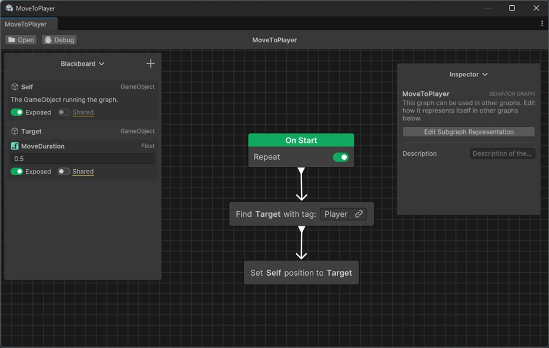
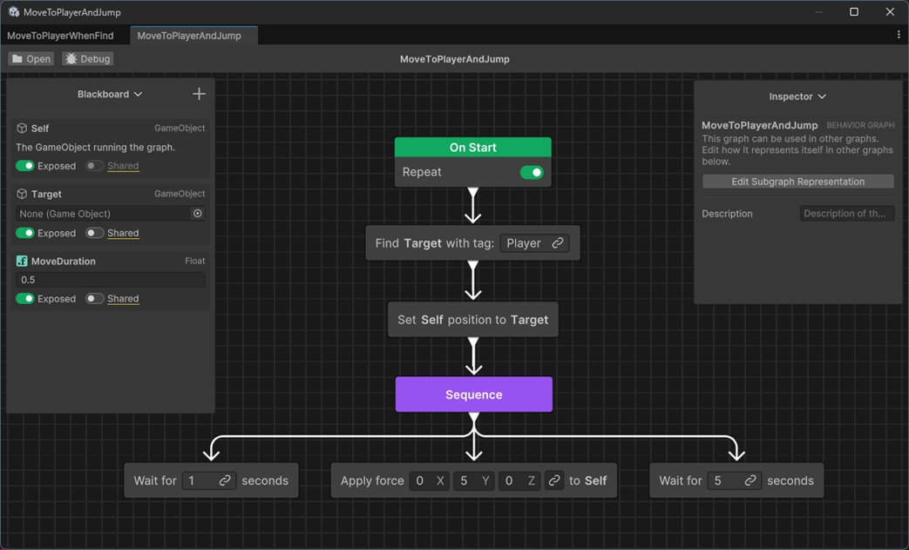
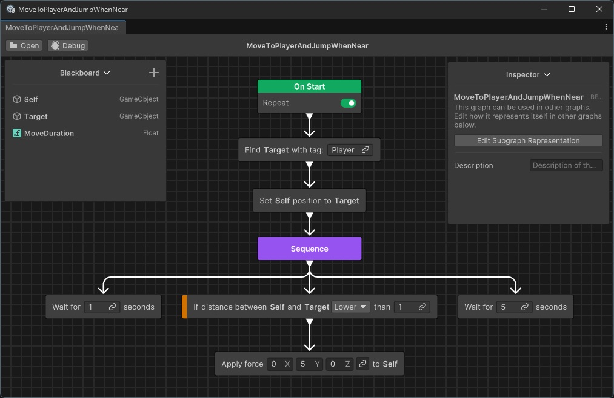
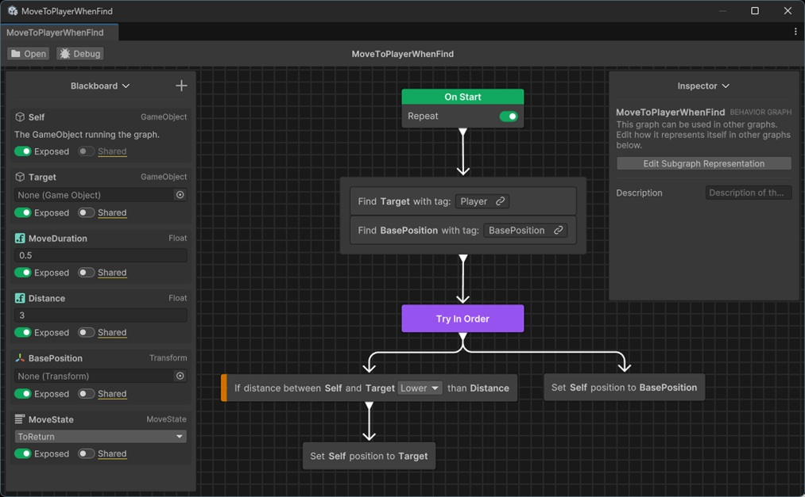
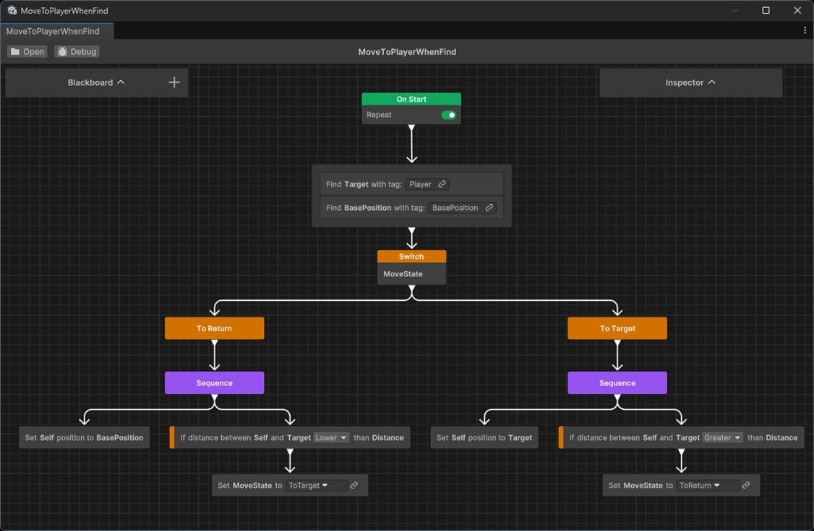
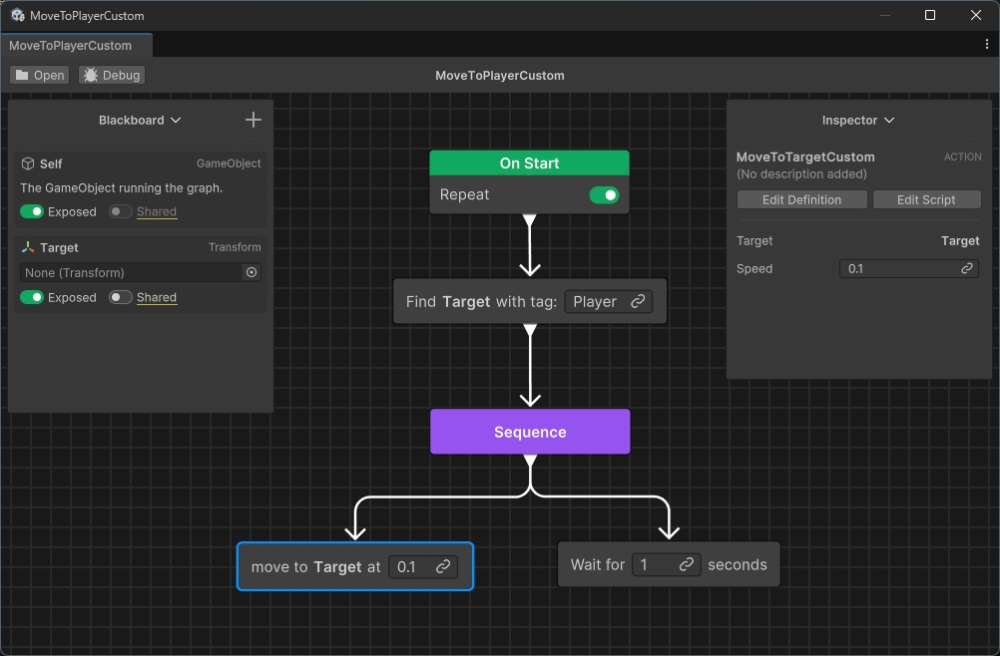

# **Behavior Tree**

---

## **Behavior Treeの概要**

Behavior Tree は AI の意思決定を  
ツリー構造で表す仕組みである。  
ゲーム開発において、敵や NPC の行動制御を  
効率的かつ直感的に設計できる。  

ツリー構造である為、各ノードが**親子関係**で繋がっており、  
その親子関係に沿ってノードを遷移する。

ルートから順にノードを辿り、  
条件や行動を評価することで AI の流れを決定する。  
条件分岐を見える形で構築できるため、  
複雑な if / else のネストを避けられる。  

### **構成要素**

Behavior Tree の基本要素は次の4つに分かれる。  

- Root  
  常に一つ存在する起点  

- Composite（合成ノード）  
  子ノードを複数持ち、順序や分岐を制御する  

- Decorator（修飾ノード）  
  条件や繰り返しの制御を付与する  

- Leaf（葉ノード）  
  実際のアクションや条件判定を行う  

概ね以下のような構造で組み立てていく事になるはず。  

```
先頭
 └─ 行動一覧
     ├─「敵を発見したか？」など条件
     │    └─ 敵を発見した時の行動
     └─ 「敵を発見したか？」に該当しない場合の行動
```  

各ノードは**深さ優先探索**というアルゴリズムで処理される。  
左側のノードから右側のノードに向かって、順番に階層を潜っていく流れ。  
各ノードは「自身の状態」を親ノードに返す。 
 
- 成功
- 失敗
- 動作中

その状態を元に処理ノードを遷移させていく。

全てのノードの遷移が終われば、その Behavior Tree は動作を終える。  
ただ、キャラの AI などは基本的に「動作を繰り返す事」が前提である為、  
全ての遷移が終わった後、また最初から遷移を開始させる場合が多い。

---

## **Blackboard**

Behavior Tree でも処理を組み立てる際は変数が必要になる。  
それら各変数は VisualScripting と同様に、**BlackBoard** で管理される。

---

## **Unity6 における Behavior Tree**

Unity6 では公式に Behavior Tree 機能が提供されている。  
Visual Scripting と同じく、エディタ上でノードを組み合わせることで、  
コードレスに AI ロジックを構築できる。  

- <span style ="color: red;">**AI 制御に特化した公式ツール**</span>  
- デザイナが直接ツリーを編集可能  
- Entities や NavMesh との連携で大規模な群衆 AI に対応可能  

Behavior Tree は NPC の思考に適している一方、  
UI やイベント処理には向かない。  
そこで Visual Scripting と役割を補完し合う。  

Blackboard に関して、登録した各変数は、  
Hierarchy で Behavior Tree を設定しているオブジェクトを選択する事で、  
Inspector からでも確認、更新する事が出来る。  

ちなみに、まだリリースされて時間があまり経っていない事もあり、  
資料は結構少ない。

---

## **Visual Scriptingとの違い**

Visual Scripting と Behavior Tree は、  
いずれも「ノードを繋いでロジックを構築する」点で似ている。  
しかし目的と得意分野、ノードの遷移ルールは大きく異なる。  

| 項目 | Behavior Tree | Visual Scripting |
|------|---------------|------------------|
| 主な用途 | 敵AIやNPCの意思決定 | ゲーム全体のロジック、UI制御、イベント |
| 表現力 | Success / Failure / Running の3値で制御 | if文やループなど通常のスクリプト構造 |
| デザイン指向 | AIデザイナやゲームデザイナ向け | プログラマ/非プログラマ両方向け |
| 制御フロー | 条件付き分岐を階層ツリーで整理 | 値の入出力で柔軟に組み合わせ可能 |
| 適用範囲 | NPC行動に強いが汎用性は低い | ゲーム全般の仕組みに幅広く対応 |

- <span style ="color: red;">**Behavior Tree は AI 思考制御、Visual Scripting は汎用制御**</span>  
- 競合ではなく補完関係にあるため、併用が実務的である  

---

## **Unity6 Behavior Tree における基本的なノード種類**

Unity6 の Behavior Tree では大きく二つに分けられる。

### **Control Flow Node（制御フローノード）**
グラフの遷移を制御するノード。  
ノードとノードを条件などに合わせて繋ぎ、  
進行の流れを選択する働きを行う。  

- Modifier Node（修飾ノード）
- Sequencing Node（シーケンスノード）
- Join Node（結合ノード）

などはこれに属する。  
基本的に子ノードは一つだが、シーケンスノードは複数の子ノードを持つ事が出来る。


### **Action Node（行動ノード）**
実際に何らかの行動を行わせるノード。  
例えば「オブジェクトを動かす」などの、  
オブジェクト個々の動作等はこちらで行う。

---

## **セットアップ**

BehaviorTree は Unity 公式で用意されているが、  
自動的にインストールされているわけではない。  
その為、各自で導入しなければならない。

1. メニューの `Window → PackageManager` を選択
2. `Unity Registry` を選択し、検索ボックスに `Behavior` と入力
3. 検索して出てきた `Behavior` を選択してインストールする

これで BehaviorTree を利用する事が出来るようになった。  

---

## **BehaviorTree の編集準備**

1. プロジェクトのフォルダに `Behavior Graph` を作成する
1. Scene に Cube を配置して `Behavior Agent` コンポーネントを追加  
1. `Behavior Agent` に `Behavior Graph` をアタッチする 
1. `Behavior Graph` をダブルクリックして `Behavior Tree 編集エディタ` を開く

---

## **基本操作例**

### **別オブジェクトを追いかける**

2. `Blackboard` で `GameObject` を追加し、名前を `Target` にする 
2. `Blackboard` で `Float` を追加し、名前を `MoveDuration` にして、値を 0.5 などにしておく
1. Scene に Sphere を配置し、Tag で Player を選択する
2. `Behavior Graph` 上で右クリックし、`Add` → `Find With Tag` を選択する 
    - Inspector (Behavior Tree Editor 内) の `Object` に `Target` を指定
    - `Tag` には `Player` を入力
2. `Behavior Graph` 上で右クリックし、`Add` → `Set Position To Target` を選択する 
    - Inspector (Behavior Tree Editor 内) の `Transform` に `Self` を指定
    - `Target` に `Target` を指定
    - `Duration` に `MoveDuration` を指定
2. 三つのノードを繋げる



ここまで組み立てて実行すると、  
Player を動かしたときに GameObject が追随する事を確認出来る。

`Find With Tag` は、
「単にタグ検索で見つかった GameObject を Blackboard の変数に紐付けているだけ」  
という認識で問題ない。


### **別オブジェクトを追いかけた後に1秒待ってジャンプする**

2. 別オブジェクトを追いかける Behavior Tree を複製する
2. Cube に Rigidbody を追加
1. `Sequence`、`Wait (Second)`2つ、`Add Force` の各ノードを追加する
1. 1つ目の `Wait (Second)` に 1 秒を、2 つ目の `Wait (Second)` に 5 秒を設定
1. `Add Force` の各項目を設定する
    - `Target` に `self` を指定
    - `Force Value` の `Y` に 5 を入力
    - `Force Mode` に `impulse` を指定
1. 各ノードを下記の流れで繋げる




こうする事で、  

1. Sphere に移動する
2. 1 秒待つ
3. その場でジャンプする
4. 5 秒待つ
1. 1に戻る

を繰り返す。

`Sequence` は**左から順にノードを遷移させる**制御を行っている

---

## **条件分岐例**

Behavior Tree は AI や行動の制御を行うのに適している。  

### **別オブジェクトを追いかけた後、1秒待って「一定範囲内にいれば」ジャンプする**

2. 別オブジェクトを追いかけてジャンプする Behavior Tree を複製する
1. `Conditional Guard` ノードを追加する
1. `Conditional Guard` の各項目を設定する
    1. `Assign Condition` をクリックして `Check Distance` を選択
    2. `Transform` に `Self` を指定
    2. `Target` に `Target` を指定
    2. コンボボックス で `Lower` を指定
    2. 数値指定で 1 を入力
1. `Sequence` と `Apply force` の間に繋ぐ




こうする事で、  

1. Sphere に移動する
2. 1 秒待つ
    - **分岐発生**
3. （近い場合）その場でジャンプする → ５秒待つ → 1 に戻る
3. （遠い場合）1 に戻る

と遷移を変化する事が出来る。

`Conditional Guard` は条件を満たさない場合に親ノードに「失敗」を返す。  
親ノードである `Sequence` は**「失敗」**を受け取ると、  
**次の子ノード（右側のノード）に進ませず、自身の親ノードへ遷移を戻す**という動作を行う。

### **別オブジェクトが近ければ追いかけ、離れれば特定の位置に戻る**

`Sequence` で子ノードを順に処理していく事が出来るが、  
一つ失敗すると、その次の子ノードが処理されなくなる。  
「A の条件を満たす時は X を、満たさないときは Y を処理させる」が行えない。

上記を実現したい場合は `Try In Oeder` が便利。

1. Scene に特定の位置を表す GameObject を作成
2. Blackboard に Transform 型の `BasePosition` 変数を追加
3. `Find With Tag` で紐づけ
4. 「別オブジェクトへ移動」と「特定の位置へ移動」の `Set Position To Target` を作成する
5. 別オブジェクトと一定距離以内か」の `Conditional Guard` を作成する
5. `Try In Order` ノードを作成する
6. `Try In Order` からノードを繋げる
    - 左側に「条件 → 別オブジェクトへ移動」
    - 右側に「特定の位置へ移動」




`Try In Oeder` は**「成功」を受け取るまで次の子ノードへ遷移させる**という動作を行う。  
最初に成功した子ノードで処理を終わらせて、親ノードに遷移を戻す。  
条件に合うノードだけ選択して処理させる場合に有用。


### **条件分岐の余談**

条件分岐では `Try In Oeder` を多用する事になるが、  
複雑になると構造的に分かりにくくなる場合がある。  
そういった分岐をわかりやすくする手段として、  
C# でいう **Switch 分岐** のようなノードも存在する。



---

## **コードによる独自アクションの追加**

Behavior Tree で利用する各アクションは、  
Action を継承する事で独自に作成出来る。  
プログラムコードの追加は編集エディタ上から行える。

1. 右クリックして `Create new` → `Action` を選択
1. `Name` に任意のアクション名を記入し `Next` を押下
    - ここに記入した名前がクラス名になる
1. このアクションの説明文を記入する
    - 説明文の単語に合わせて Blackboard 変数を設定できる様になる
    - `move to target at seconds` と記述して`target`の型を`transform`、`seconds`を`float`にする
    - 単語を変数とする場合は型を指定する必要がある
1. `Create` を押下して、任意の場所に C# スクリプトを保存
1. 生成された C# を編集してアクション内容を自作


### **ターゲットの方向に旋回して移動し続け、一度近づくと１秒待って再度追跡を行う**

**「ターゲットの方向に旋回して移動し続ける」**アクションを自作する

```csharp
using System;
using Unity.Behavior;
using UnityEngine;
using Action = Unity.Behavior.Action;
using Unity.Properties;

[Serializable, GeneratePropertyBag]
[NodeDescription(name: "MoveToTargetCustom", story: "move to [target] at [speed]", category: "Action", id: "2e3c9a78f17d07473ff279ad26adf9f4")]
/// 「ターゲットの方向に旋回して移動し続ける」アクションクラス
public partial class MoveToTargetCustomAction : Action
{
    [SerializeReference] public BlackboardVariable<Transform> Target;
    [SerializeReference] public BlackboardVariable<float> Speed;

	// 更新処理
	protected override Status OnUpdate()
    {
		// Target がいない場合は「失敗」を返す
		if (Target?.Value == null)
		{
			return Status.Failure;
		}

		// ターゲットに一定距離まで近づいたら「成功」を返す
		if (Vector3.Distance(GameObject.transform.position, Target.Value.position) < 1.0f)
		{
			return Status.Success;
		}

		// ターゲットに向かって移動する
		GameObject.transform.LookAt(Target.Value.position);
		GameObject.transform.position += GameObject.transform.forward * Speed.Value;
		// 移動中は「動作中」を返す
		return Status.Running;
	}
}
```  

このアクションを Behavior Tree で呼び出し、 `Sequence` を利用して、  
**「成功」を返した後だけ「1 秒待つ」が行われるように繋げる**




---

## **応用と拡張**

- ステートマシンと組み合わせ、アニメーション制御を実現  
- Utility AI（優先度ベースAI）との統合による柔軟な意思決定  
- ECS や Job System との併用で大規模な群集 AI も効率化  

---

## **まとめ**

- Behavior Tree は NPC の行動制御に特化したツール  
- Visual Scripting はゲーム全体の制御に適した汎用ツール  
- <span style ="color: red;">**両者は競合ではなく補完関係**</span>  
- 小さな行動から構築し、段階的に拡張するのがコツ